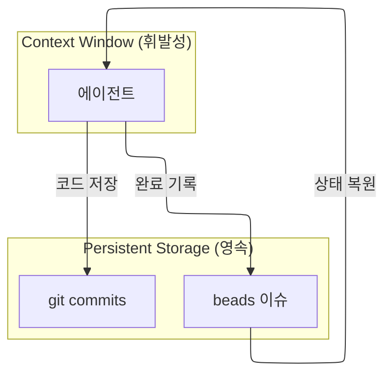

# 컨텍스트 관리 가이드

이 가이드는 에이전트가 컨텍스트 한계를 극복하고 작업 연속성을 보장하는 전략을 설명합니다.

> **핵심 원칙**: beads가 Single Source of Truth — 이슈 상태로 추적

## 문제: 서브에이전트 컨텍스트 한계

Claude Code의 서브에이전트는 **auto compact를 지원하지 않습니다**.
컨텍스트가 가득 차면 에이전트가 강제 종료됩니다.

| 구분 | 메인 에이전트 | 서브에이전트 |
|------|-------------|-------------|
| Auto Compact | 자동 | 미지원 |
| 컨텍스트 한계 시 | 자동 요약 | **강제 종료** |

## 해결: beads 이슈 기반 상태 관리



## 에이전트 시작 프로토콜

모든 에이전트는 작업 시작 전 다음 단계를 수행합니다:

```bash
# 1. 이슈 상태 확인
bd show <issue-id>

# 2. 관련 이슈 확인
bd list --parent <epic-id>
```

### 목적

1. **상태 복원**: 이전 세션에서 중단된 지점 파악
2. **중복 방지**: 이미 완료된 작업 재수행 방지
3. **컨텍스트 효율**: 필요한 정보만 로드

## 에이전트 종료 프로토콜

### 정상 완료
```bash
# 1. 이슈 업데이트 및 close
bd update <issue-id> --description "완료 요약"
bd close <issue-id>
```

### 중단 시 (컨텍스트 부족 예상)
```bash
# 1. 현재 상태를 이슈 코멘트에 저장
bd comments add <epic-id> "[Checkpoint] <에이전트명> <진행률>% - <현재상태>"

# 2. 작업 중인 파일 저장
git add -A && git commit -m "WIP: <작업내용>"
```

## 토큰 효율화 전략

### 1. 이슈 ID만 전달
```
# ❌ 비효율
"UserService를 구현하세요. 요구사항은 다음과 같습니다: ..."

# ✅ 효율
"bd-abc123 작업 수행. bd show로 상세 확인."
```

### 2. 상세는 이슈에, 반환은 ID만
```
# 에이전트 → start 스킬
완료: bd-abc123

# start 스킬 → 사용자
완료: bd-epic-123 | 상태: closed | 상세: bd show bd-epic-123
```

### 3. 불필요한 파일 읽기 금지
- 전체 파일 대신 필요한 부분만 읽기
- 이미 분석한 파일 재분석 금지

## 재개 워크플로우

```bash
# 1. Sub-task 상태 확인 (주요 판단 기준)
bd list --parent <epic-id>

# 2. Epic 코멘트 확인
bd comments <epic-id>

```

### 재개 지점 결정

| 상태 | 재개 지점 |
|------|----------|
| Sub-task `in_progress` | 해당 에이전트부터 |
| Sub-task 모두 `open` | 처음부터 |
| 일부 Sub-task `closed` | 다음 `open`부터 |

## 요약

1. **시작**: 이슈 상태 확인
2. **진행**: 중요 단계마다 이슈에 기록
3. **종료**: 이슈 close
4. **재개**: Sub-task 상태로 재개 지점 결정
