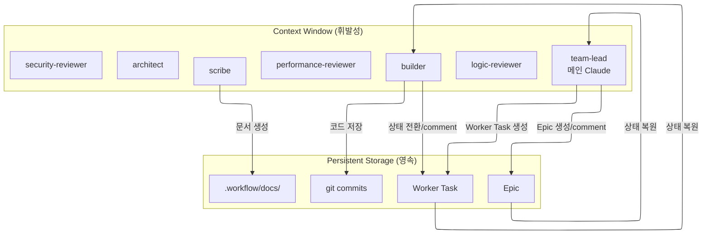

# 컨텍스트 관리 가이드

이 가이드는 team-lead(메인 Claude)와 서브에이전트가 컨텍스트 한계를 극복하고 작업 연속성을 보장하는 전략을 설명합니다.

> **핵심 원칙**: beads가 Single Source of Truth — 이슈 상태로 추적

## 문제: 서브에이전트 컨텍스트 한계

Claude Code의 서브에이전트는 **auto compact를 지원하지 않습니다**.
컨텍스트가 가득 차면 에이전트가 강제 종료됩니다.

| 구분 | team-lead | 서브에이전트 |
|------|-----------------------|----------------------------------------|
| Auto Compact | 자동 | 미지원 |
| 컨텍스트 한계 시 | 자동 요약 | **강제 종료** |

## 해결: beads 이슈 기반 상태 관리



## team-lead의 컨텍스트 관리

team-lead는 **전 생명주기를 소유**하므로 가장 긴 컨텍스트를 갖지만, 메인 Claude는 **auto compact를 지원**하므로 서브에이전트보다 유리합니다. 다음을 원칙으로 합니다:

1. **architect의 설계 초안을 Worker Task description에 즉시 기록** — 자신의 컨텍스트는 요약만 유지
2. **builder 완료 보고의 브랜치/경로/파일 목록은 세션 상태 변수로 보관** — 코드 반영 시 사용
3. **리뷰 피드백 취합 결과를 Epic comment에 기록** — 라운드별 `[리뷰 취합 #N]`
4. **Epic comment에 주요 체크포인트 기록** — 재개 시 진입점 제공

### 체크포인트 기록 시점 (Epic comment)

| 시점 | Epic comment |
|------|-------------|
| 워크플로우 시작 | `[Workflow] 시작` |
| 리뷰 취합 완료 | `[리뷰 취합 #N]` — auto-fix/user-decision 건수, 요약 |
| 최종 승인 | `[Workflow] 완료` |
| 사용자 취소 | `[Workflow] 사용자 취소` |
| 설계 리스크 중단 | `[Workflow] 설계 리스크로 중단` |

## architect의 컨텍스트 관리

architect는 **설계 단계와 리뷰 단계에서 동일 세션을 유지**합니다. 이는 큰 이점입니다:

- 설계 시 분석한 코드베이스 지식이 아키텍처 리뷰에 재활용 → 토큰 효율
- 설계 의도를 가장 잘 아는 에이전트가 아키텍처 준수 여부를 검증 → 리뷰 정밀도

### 주의사항
- architect의 피드백은 SendMessage로만 전달되므로, team-lead가 Epic comment에 병합 기록하여 영속성 확보
- 컨텍스트가 소실되면 재spawn 필요 — 설계 초안은 Worker Task description에 이미 기록되어 있으므로 복원 가능

## builder의 컨텍스트 관리

각 builder는 자신의 Worker Task 하나만 담당하므로 컨텍스트가 가볍습니다.

### 시작 프로토콜

```bash
# 1. 자신의 Worker Task 확인 (상세 요구사항)
bd show <worker-task-id>

# 2. Epic 확인 (전체 컨텍스트)
bd show <epic-id>

# 3. 상태 전환
bd update <worker-task-id> --status in_progress
```

### 종료 프로토콜

1. 변경 내역을 Worker Task comment로 기록 → `bd close`
2. team-lead에 `SendMessage [작업 완료]` 명시 호출 (브랜치·경로·변경 파일 포함)

템플릿은 `guides/beads-issue-guide.md` "Worker Task 완료 기록" 섹션 참조.

### 중단 시 (컨텍스트 부족 예상)

```bash
# 1. 현재 진행 상황을 Worker Task comment에 저장
bd comments add <worker-task-id> "[Checkpoint] 진행률 N% - 현재 상태: ..."

# 2. worktree에 WIP 커밋 저장
git add -A && git commit -m "WIP: <작업 내용>"
```

## 리뷰어의 컨텍스트 관리

3명의 리뷰어(security-reviewer, performance-reviewer, logic-reviewer)는 공통적으로:

- 리뷰 피드백을 SendMessage로만 보고 (이슈 생성 없음)
- 라운드 간 컨텍스트는 동일 세션에서 유지 (resume)
- 컨텍스트 소실 시 재spawn 필요 — 이전 리뷰 결과는 team-lead의 Epic comment에 기록되어 있으므로 복원 가능

## scribe의 컨텍스트 관리

scribe는 리뷰 완료 후 한 번만 호출됩니다:

- 구현 코드를 읽고 `.workflow/docs/<epic-id>/`에 문서 생성
- 컨텍스트 부담이 적음 (1회성 작업)
- 문서 파일이 영속 저장소 역할

## SendMessage ↔ 이슈 동기화 원칙

모든 에이전트에 공통 적용:

> SendMessage로 오간 **확정된 정보**(리뷰 취합 결과, 재작업 지시, user-decision 옵션 설명 등)는 team-lead가 Epic comment에 동기화 기록합니다.

이유: 컨텍스트가 소실되거나 `--resume`으로 재진입하는 경우, SendMessage 대화 맥락은 복원되지 않습니다. beads 이슈만이 영속 저장소입니다.

## 토큰 효율화 전략

### 1. 이슈 ID만 전달

```
# ❌ 비효율
"AKS 클러스터 통합 기능을 구현하세요. 요구사항은 다음과 같습니다: ..."

# ✅ 효율
"Worker Task: bd-abc123. bd show로 상세 확인. 완료 시 closed 전환."
```

### 2. 상세는 이슈에, 반환은 ID만

```
# builder → team-lead (SendMessage 명시 호출)
[작업 완료] Worker Task: bd-abc123
- 브랜치: ...
- 경로: ...
- 변경 파일: ...
- 테스트: PASS
```

### 3. 불필요한 파일 읽기 금지

- 전체 파일 대신 필요한 부분만 읽기 (serena symbol 도구 활용)
- 이미 분석한 파일 재분석 금지

## 재개 워크플로우

`/workflow:teams --resume <epic-id>` 실행 시:

```bash
# 1. Epic 상태 확인
bd show <epic-id>

# 2. 하위 이슈 확인
bd list --parent <epic-id> --tree

# 3. Epic 체크포인트 확인
bd comments <epic-id>
```

### 재개 지점 결정

재개 시 team-lead는 Epic·하위 이슈 상태를 역추적하여 현재 단계를 판정하고, `TeamCreate` + 서브에이전트 재spawn(7명) 후 해당 단계부터 이어갑니다.

| 현재 상태 | 재개 지점 |
|----------|----------|
| `[Workflow] 시작` comment 존재, Worker Task 없음 | architect에 `[설계 요청]` 재전달 (Plan 재개) |
| Worker Task `in_progress` 존재 | 해당 builder에 `[작업 할당]` 재전달 (신규 지시) |
| Worker Task 모두 `closed`, 리뷰 취합 미완료 | 코드 반영 + 병렬 리뷰 요청 재전달 |
| `[리뷰 취합 #N]` comment 존재, 재작업 중 | 해당 builder에 `[재작업 요청]` 재전달 |
| `[Workflow] 사용자 취소` / `[Workflow] 설계 리스크로 중단` / `[Workflow] 완료` comment | 재개 불가 (이미 종료). 새 워크플로우로 시작 권장 |

**재spawn 시 주의**: 이전 세션의 SendMessage 대화 맥락은 복원되지 않습니다. 모든 필수 정보는 beads 이슈(Worker Task description, Epic comment)에 영속 기록되어 있어야 합니다.

## 요약

1. **시작**: 자신의 이슈와 Epic 확인
2. **진행**: 중요 단계마다 comment/상태 전환으로 기록
3. **종료**: 이슈 close(builder) + team-lead에 SendMessage 보고
4. **재개**: Epic + 하위 이슈 상태로 진입점 결정
5. **team-lead**: Epic comment로 체크포인트 기록하여 재개 용이성 확보
