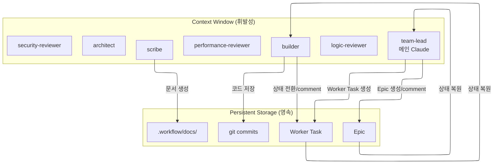

# 컨텍스트 관리 + 재개 가이드

이 가이드는 team-lead(메인 Claude)와 서브에이전트가 컨텍스트 한계를 극복하고 작업 연속성을 보장하는 전략, 그리고 `--resume`으로 워크플로우를 재개하는 절차를 설명합니다.

> **핵심 원칙**: beads가 Single Source of Truth — 이슈 상태로 추적

## 1. 문제: 서브에이전트 컨텍스트 한계

Claude Code의 서브에이전트는 **auto compact를 지원하지 않습니다**. 컨텍스트가 가득 차면 에이전트가 강제 종료됩니다.

| 구분 | team-lead | 서브에이전트 |
|------|-----------|-------------|
| Auto Compact | 자동 | 미지원 |
| 컨텍스트 한계 시 | 자동 요약 | **강제 종료** |

## 2. 해결: beads 이슈 기반 상태 관리



## 3. team-lead의 컨텍스트 관리

team-lead는 **전 생명주기를 소유**하므로 가장 긴 컨텍스트를 갖지만, 메인 Claude는 **auto compact를 지원**하므로 서브에이전트보다 유리합니다. 원칙:

1. **architect의 설계 초안을 Worker Task description에 즉시 기록** — 자신의 컨텍스트는 요약만 유지
2. **builder 완료 보고의 브랜치/경로/파일 목록은 세션 상태로 보관** — 코드 반영 시 사용
3. **리뷰 피드백 취합 결과를 Epic comment에 기록** — 라운드별 `[리뷰 취합 #N]`
4. **Epic comment에 주요 체크포인트 기록** — 재개 시 진입점 제공

### 체크포인트 기록 시점 (Epic comment)

| 시점 | Epic comment |
|------|-------------|
| 워크플로우 시작 | `[Workflow] 시작` |
| 리뷰 취합 완료 | `[리뷰 취합 #N]` — auto-fix/user-decision 건수, 요약 |
| 최종 승인 | `[Workflow] 완료` |
| 사용자 취소 | `[Workflow] 사용자 취소` |
| 설계 리스크 중단 | `[Workflow] 설계 리스크로 중단` |

## 4. architect의 컨텍스트 관리

architect는 **설계 단계 전담**입니다 (아키텍처 리뷰는 logic-reviewer가 담당, self-review 방지 목적). 컨텍스트 부담은 중간 수준이며, 재설계 요청 시 이전 분석 결과 재사용.

### 주의사항
- architect는 설계 산출물을 SendMessage로만 보고하므로, team-lead가 Worker Task description·Epic comment에 병합 기록하여 영속성 확보
- 컨텍스트가 소실되면 재spawn 필요 — 설계 초안은 Worker Task description에 이미 기록되어 있어 복원 가능

## 5. builder의 컨텍스트 관리

각 builder는 자신의 Worker Task 하나만 담당하므로 컨텍스트가 가볍습니다.

### 시작 프로토콜

```bash
bd show <worker-task-id>   # 상세 요구사항
bd show <epic-id>          # 전체 컨텍스트
bd update <worker-task-id> --status in_progress
```

### 종료 프로토콜

1. 변경 내역을 Worker Task comment로 기록 → `bd close`
2. team-lead에 SendMessage 명시 호출 (브랜치·경로·변경 파일 포함)

템플릿: `guides/beads-issue-guide.md` "Worker Task 완료 기록" 섹션.

### 중단 시 (컨텍스트 부족 예상)

```bash
bd comments add <worker-task-id> "[Checkpoint] 진행률 N% - 현재 상태: ..."
git add -A && git commit -m "WIP: <작업 내용>"
```

## 6. 리뷰어의 컨텍스트 관리

3명의 리뷰어(security-reviewer, performance-reviewer, logic-reviewer) 공통:

- 리뷰 피드백을 SendMessage로만 보고 (이슈 생성 없음)
- 라운드 간 컨텍스트는 동일 세션에서 유지 (resume)
- 컨텍스트 소실 시 재spawn 필요 — 이전 리뷰 결과는 team-lead의 Epic comment에 기록되어 있어 복원 가능
- **logic-reviewer**는 로직 + 아키텍처(SOLID/레이어) 통합 검증이므로 컨텍스트가 가장 무겁습니다. 재spawn 시 우선 대상.

## 7. scribe의 컨텍스트 관리

scribe는 **조건부 on-demand 호출**입니다 (항상 실행되지 않음):

- team-lead 판단 시 호출 (새 API, 아키텍처 신설, Breaking change, 사용자 노출 기능)
- 구현 코드 Read 후 `.workflow/docs/<epic-id>/` 생성
- 컨텍스트 부담 적음 (1회성 작업)

## 8. SendMessage ↔ 이슈 동기화 원칙

> SendMessage로 오간 **확정된 정보**(리뷰 취합 결과, 재작업 지시, user-decision 옵션 설명 등)는 team-lead가 Epic comment에 동기화 기록합니다.

이유: 컨텍스트 소실 또는 `--resume` 재진입 시, SendMessage 대화 맥락은 복원되지 않습니다. beads 이슈만이 영속 저장소입니다.

## 9. 토큰 효율화 전략

### 9-1. 이슈 ID만 전달

```
❌ "AKS 클러스터 통합 기능을 구현하세요. 요구사항은 다음과 같습니다: ..."
✅ "Worker Task: bd-abc123. bd show로 상세 확인. 완료 시 closed 전환."
```

### 9-2. 상세는 이슈에, 반환은 ID만

builder → team-lead 보고는 메타 정보만:
```
작업 완료 — Worker Task bd-abc123
- 브랜치: ... / 경로: ... / 변경 파일: ... / 테스트: PASS / 빌드: PASS
```

### 9-3. 불필요한 파일 Read 금지

- 전체 파일 대신 필요한 부분만 (Serena 심볼 도구 활용)
- 이미 분석한 파일 재분석 금지

## 10. 재개 워크플로우 (`--resume`)

### 공식 제한사항 (Claude Code Agent Teams)

> **중요**: Claude Code 공식 문서에 따르면 `--resume`은 in-process 팀원 복구를 지원하지 않습니다. lead가 존재하지 않는 팀원에게 메시지를 보내려 할 수 있습니다. 이 경우 team-lead가 새 팀원을 spawn해야 합니다.

우리 워크플로우는 이 제한사항을 **beads 이슈 기반 영속 저장**으로 우회합니다.

### 재개 절차

```bash
# 1. Epic 상태 확인
bd show <epic-id>

# 2. 하위 이슈 트리 확인
bd list --parent <epic-id> --tree

# 3. Epic 체크포인트 확인
bd comments <epic-id>

# 4. 통합 worktree 존재 확인
ls .claude/worktrees/wf-<epic-id>/ 2>/dev/null && echo "worktree 존재" || echo "재생성 필요"
```

### 재개 지점 결정 매트릭스

| Epic 상태 / 하위 이슈 상태 | 재개 지점 | team-lead 작업 |
|-----------------------------|----------|----------------|
| `[Workflow] 시작` comment, Worker Task 없음 | Plan 재개 | architect 재spawn + 설계 요청 재전달 |
| Worker Task `in_progress` 존재 | 구현 재개 | 해당 builder 재spawn + `EnterWorktree(name: "builder-N")` 재진입 후 작업 할당 재전달 |
| Worker Task 모두 `closed`, 리뷰 취합 미완료 | 리뷰 재개 | 3명 reviewer 재spawn + 병렬 리뷰 요청 재전달 |
| `[리뷰 취합 #N]` comment 존재, 재작업 중 | 피드백 반영 재개 | 해당 builder 재spawn + 재작업 요청 재전달 |
| `[Workflow] 사용자 취소` / `[Workflow] 설계 리스크로 중단` / `[Workflow] 완료` comment | 재개 불가 | 새 워크플로우로 시작 권장 |

### 재spawn 시 주의

- 이전 세션의 SendMessage 대화 맥락은 복원되지 않음. 모든 필수 정보는 beads 이슈(Worker Task description, Epic comment)에 영속 기록되어 있어야 함
- builder 재spawn 시 `EnterWorktree(name: "builder-N")` — 동일 이름 사용 시 기존 worktree에 재진입 가능
- 통합 worktree(`.claude/worktrees/wf-<epic-id>`)가 남아있으면 그대로 사용. 없으면 재생성:
  ```bash
  git worktree add .claude/worktrees/wf-<epic-id> wf-<epic-id>  # 브랜치 존재 시
  # 또는 브랜치도 없으면 처음부터 재설정
  ```

### 재개 스크립트 (참조용)

```bash
#!/usr/bin/env bash
# .claude/scripts/workflow-resume.sh
set -e
EPIC_ID="$1"

# 1. Epic 확인
bd show "$EPIC_ID" || { echo "Epic not found"; exit 1; }

# 2. 진행 상태 판별
COMMENTS=$(bd comments "$EPIC_ID")
if echo "$COMMENTS" | grep -q "\[Workflow\] 완료\|\[Workflow\] 사용자 취소\|\[Workflow\] 설계 리스크"; then
  echo "이미 종료된 워크플로우. 새 워크플로우로 시작하세요."
  exit 0
fi

# 3. worktree 복구
if [[ ! -d ".claude/worktrees/wf-$EPIC_ID" ]]; then
  git worktree add ".claude/worktrees/wf-$EPIC_ID" "wf-$EPIC_ID" 2>/dev/null \
    || { echo "통합 worktree 재생성 필요. team-lead에 위임"; }
fi

# 4. 하위 이슈 상태 출력 (team-lead가 진단)
bd list --parent "$EPIC_ID" --tree
bd comments "$EPIC_ID" | tail -20
```

## 11. 요약

1. **시작**: 자신의 이슈와 Epic 확인
2. **진행**: 중요 단계마다 comment/상태 전환으로 기록
3. **종료**: 이슈 close(builder) + team-lead에 SendMessage 보고
4. **재개**: Epic + 하위 이슈 상태로 진입점 결정 + 팀 재spawn
5. **team-lead**: Epic comment로 체크포인트 기록하여 재개 용이성 확보
