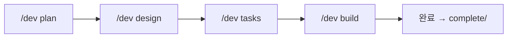

# Development Workflow Skill

## 목적

구조화된 개발 워크플로우를 통해 체계적인 소프트웨어 개발을 지원합니다.

## 활성화 조건

- "새 기능", "프로젝트 시작", "개발 시작" 요청 시
- "설계해줘", "아키텍처", "PRD", "요구사항" 언급 시
- "기획", "브레인스토밍", "아이디어" 언급 시
- `/dev` 명령어 사용 시

## 폴더 구조

```
.claude/docs/
├── active/                          ← 진행 중인 기능
│   └── {feature-name}/
│       ├── 01-brainstorm.md         ← /dev plan
│       ├── 02-prd.md                ← /dev plan
│       ├── 03-architecture.md       ← /dev design
│       ├── 04-erd.md                ← /dev design
│       ├── 05-tasks.md              ← /dev tasks
│       └── qa/                      ← /qa
│
└── complete/                        ← worktree 100% 완료 시 자동 이동
    └── {완료된-기능}/
```

## 워크플로우 단계



### Phase 1: Plan (기획)

브레인스토밍 + PRD 작성

| 옵션 | 설명 |
|------|------|
| `/dev plan [아이디어]` | 전체 실행 |
| `/dev plan --brainstorm` | 브레인스토밍만 |
| `/dev plan --prd` | PRD만 |

**산출물**:
- `.claude/docs/active/{feature}/01-brainstorm.md`
- `.claude/docs/active/{feature}/02-prd.md`

### Phase 2: Design (설계)

아키텍처 + ERD 설계

| 옵션 | 설명 |
|------|------|
| `/dev design` | 전체 실행 |
| `/dev design --arch` | 아키텍처만 |
| `/dev design --erd` | ERD만 |

**산출물**:
- `.claude/docs/active/{feature}/03-architecture.md`
- `.claude/docs/active/{feature}/04-erd.md`

### Phase 3: Tasks (태스크 분해)

구현 태스크 분해 및 worktree 생성

| 명령어 | 설명 |
|--------|------|
| `/dev tasks` | 태스크 분해 + worktree.json 생성 |

**산출물**:
- `.claude/docs/active/{feature}/05-tasks.md`
- `.claude-state/worktree.json`

### Phase 4: Build (구현)

베스트 프랙티스 적용 코드 생성

| 옵션 | 설명 |
|------|------|
| `/dev build [task-id]` | 일반 구현 |
| `/dev build [task-id] --tdd` | TDD 모드 (RED→GREEN→REFACTOR) |

## 활성화 시 프로토콜

### 1. 현재 상태 확인

```
memory/CURRENT_CONTEXT.md 읽기
→ 진행 중인 워크플로우가 있는지 확인
```

### 2. 워크플로우 안내

```
============================================
[DEV WORKFLOW] 개발 워크플로우
============================================

 현재 상태: {상태}
 진행 단계: {Plan | Design | Tasks | Build}

 사용 가능한 명령어:

 기획:
• /dev plan [아이디어]      - 브레인스토밍 + PRD
• /dev plan --brainstorm   - 브레인스토밍만
• /dev plan --prd          - PRD만

 설계:
• /dev design              - 아키텍처 + ERD
• /dev design --arch       - 아키텍처만
• /dev design --erd        - ERD만

 태스크:
• /dev tasks               - 태스크 분해

 구현:
• /dev build [task-id]     - 구현
• /dev build [task-id] --tdd - TDD 모드

 상태:
• /dev status              - 진행 상황 확인

============================================
```

### 3. 상태 저장

`memory/CURRENT_CONTEXT.md`에 워크플로우 상태 기록

## 참조 파일

- `memory/TECH_STACK.md` - 기술 스택 및 베스트 프랙티스
- `templates/` - 문서 템플릿
- `best-practices/` - 기술별 베스트 프랙티스
- `.claude-state/worktree.json` - 작업 상태
