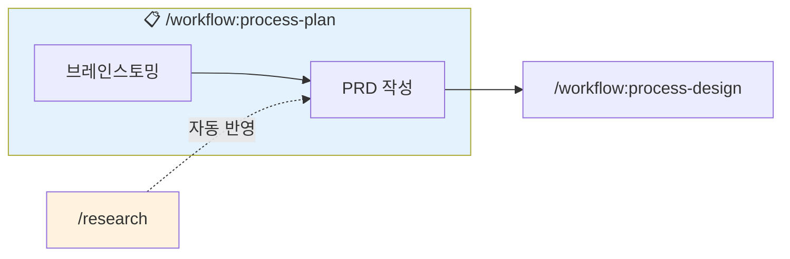

# 기획 (Plan)

## 목적

아이디어를 체계적으로 정리하고 요구사항 문서(PRD)를 작성합니다.

## 폴더 구조

```
.claude/docs/
├── active/                          ← 진행 중인 기능
│   └── {feature-name}/              ← 기능별 폴더 (이 명령어에서 생성)
│       ├── 01-brainstorm.md
│       ├── 02-prd.md
│       ├── 03-architecture.md       ← /workflow:process-design에서 생성
│       ├── 04-erd.md                ← /workflow:process-design에서 생성
│       ├── 05-tasks.md              ← /workflow:process-tasks에서 생성
│       └── qa/                      ← /qa에서 생성
│
└── complete/                        ← worktree 완료 시 자동 이동
    └── {완료된-기능}/
```

## 워크플로우



**자동 연계:**
- `/research` 결과가 있으면 PRD 작성 시 자동 참조
- 완료 후 `/workflow:process-design` 으로 자연스럽게 이어짐

## 옵션

| 옵션 | 설명 |
|------|------|
| (기본) | brainstorm + prd 순차 실행 |
| `--brainstorm` | 브레인스토밍만 실행 |
| `--prd` | PRD 작성만 실행 |

## 실행 절차

### Step 1: 옵션 확인

$ARGUMENTS에서 옵션 확인:
- `--brainstorm`: Phase 1만 실행
- `--prd`: Phase 2만 실행
- 옵션 없음: Phase 1 → Phase 2 순차 실행

### Step 2: 기능 이름 결정

$ARGUMENTS에서 기능 이름을 추출하거나 사용자에게 질문:

```
이 기능의 이름을 정해주세요.
예: user-authentication, payment-system, product-catalog
```

**네이밍 규칙:**
- 영문 소문자 + 하이픈
- 간결하고 명확한 이름
- 예: `user-auth`, `order-management`, `ai-chat`

### Step 3: 프로젝트 폴더 생성

`.claude/docs/active/{feature-name}/` 폴더 생성


## Phase 2: PRD 작성

### 2.1 컨텍스트 로드

```
1. .claude/docs/active/{feature-name}/01-brainstorm.md - 브레인스토밍 결과
2. templates/prd-template.md - PRD 템플릿
3. .claude/research/{관련주제}/ - 관련 리서치 (있는 경우)
```

### 2.2 리서치 결과 자동 통합

`.claude/research/` 디렉토리에서 관련 리서치 검색 후 자동 반영

### 2.3 PRD 작성

다음 섹션 포함:

1. **배경 및 목적**
2. **목표 및 비목표**
3. **사용자 스토리**
4. **기능 요구사항** (우선순위: P0/P1/P2)
5. **비기능 요구사항**
6. **성공 지표 (KPIs)**

### 2.4 PRD 문서 저장

`.claude/docs/active/{feature-name}/02-prd.md` 생성
