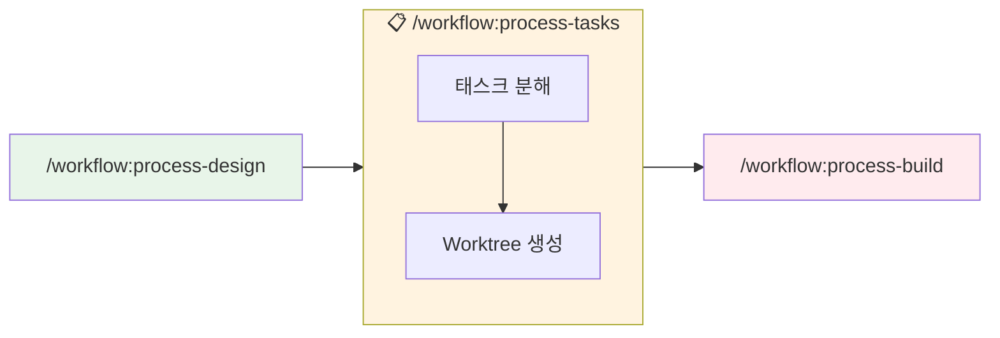
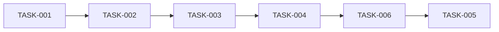

# 태스크 분해

## 목적

PRD와 아키텍처 문서를 기반으로 구현 가능한 태스크로 분해합니다.

## 폴더 구조

```
.claude/docs/
├── active/                          ← 진행 중인 기능
│   └── {feature-name}/              ← 기능별 폴더
│       ├── 01-brainstorm.md         ← /workflow:process-plan에서 생성
│       ├── 02-prd.md                ← /workflow:process-plan에서 생성
│       ├── 03-architecture.md       ← /workflow:process-design에서 생성
│       ├── 04-erd.md                ← /workflow:process-design에서 생성
│       ├── 05-tasks.md              ← 이 명령어에서 생성
│       └── qa/                      ← /qa에서 생성
│
└── complete/                        ← worktree 완료 시 자동 이동
    └── {완료된-기능}/
```

## 워크플로우



**자동 연계:**
- `/workflow:process-design`에서 생성된 아키텍처/ERD 자동 참조
- 완료 시 `worktree.json` 자동 생성
- `/workflow:process-build`로 구현 시작

## 사용법

| 명령어 | 설명 |
|--------|------|
| `/workflow:process-tasks` | CURRENT_CONTEXT에서 현재 기능 자동 감지 |
| `/workflow:process-tasks user-auth` | 특정 기능(user-auth) 지정 |

## 실행 절차

### Step 1: 기능 폴더 확인

`.claude/memory/CURRENT_CONTEXT.md`에서 현재 작업 중인 기능 확인:

```
현재 기능: {feature-name}
작업 폴더: .claude/docs/active/{feature-name}/
```

**⚠️ 주의**: `/workflow:process-plan`과 `/workflow:process-design`이 먼저 실행되어 있어야 합니다!

### Step 2: 컨텍스트 로드

```
1. .claude/memory/CURRENT_CONTEXT.md - 현재 작업 상태
2. .claude/docs/active/{feature-name}/02-prd.md - PRD 문서
3. .claude/docs/active/{feature-name}/03-architecture.md - 아키텍처 문서
4. .claude/docs/active/{feature-name}/04-erd.md - ERD 문서
```

### Step 3: 에픽 정의

PRD의 기능 요구사항을 에픽으로 그룹화:

```
Epic 1: 사용자 인증
Epic 2: 상품 관리
Epic 3: 주문 처리
```

### Step 4: 스토리 분해

각 에픽을 사용자 스토리로 분해:

```
Epic 1: 사용자 인증
├── Story 1.1: 회원가입
├── Story 1.2: 로그인
├── Story 1.3: 로그아웃
└── Story 1.4: 비밀번호 재설정
```

### Step 5: 태스크 분해

각 스토리를 구현 태스크로 분해:

```
Story 1.1: 회원가입
├── TASK-001: User 테이블 마이그레이션
├── TASK-002: RegisterDto 정의
├── TASK-003: AuthService.register() 구현
├── TASK-004: AuthController POST /auth/register 구현
├── TASK-005: 회원가입 폼 컴포넌트 구현
├── TASK-006: useRegister 커스텀 훅 구현
└── TASK-007: 회원가입 유닛 테스트 작성
```

### 🚨 Step 5.5: Acceptance Criteria 정의 (필수!)

> **CRITICAL**: 모든 Task에 반드시 검증 가능한 AC를 3~5개 정의하세요!

**AC 작성 규칙:**
1. **구체적**: "구현함" ❌ → "사용자가 이메일로 가입할 수 있음" ✅
2. **검증 가능**: 테스트나 확인으로 통과/실패 판단 가능
3. **완전성**: 이 AC만 충족하면 Task가 "완료"라고 할 수 있어야 함

**AC 예시:**
```markdown
#### TASK-003: AuthService.register() 구현

**🚨 Acceptance Criteria:**
- [ ] AC1: register(dto) 메서드가 User 객체를 반환
- [ ] AC2: 중복 이메일 시 ConflictException 발생
- [ ] AC3: 비밀번호가 bcrypt로 해싱되어 저장
- [ ] AC4: 성공 시 DB에 새 레코드 생성
- [ ] AC5: 유닛 테스트 3개 이상 통과
```

**⚠️ AC 없이 Task를 생성하지 마세요! AC가 없으면 완료 검증이 불가능합니다.**

### Step 6: 의존성 분석



### Step 7: 우선순위 결정

```
P0 (Critical): 기능의 핵심, 즉시 필요
P1 (High): 중요하지만 조금 미룰 수 있음
P2 (Medium): 있으면 좋음
P3 (Low): 나중에 해도 됨
```

### Step 8: 태스크 문서 작성

`.claude/docs/active/{feature-name}/05-tasks.md` 작성:

```markdown
# 태스크 목록: {기능명}

**작성일**: {날짜}
**총 태스크**: {n}개


## Epic 1: {에픽명}

### Story 1.1: {스토리명}

| ID | 태스크 | 우선순위 | 의존성 | 상태 |
|----|--------|---------|--------|------|
| TASK-001 | User 테이블 마이그레이션 | P0 | - | TODO |
| TASK-002 | RegisterDto 정의 | P0 | TASK-001 | TODO |
| TASK-003 | AuthService.register() 구현 | P0 | TASK-002 | TODO |
| TASK-004 | AuthController 구현 | P0 | TASK-003 | TODO |
| TASK-005 | 회원가입 폼 컴포넌트 | P1 | TASK-004 | TODO |
| TASK-006 | useRegister 훅 구현 | P1 | TASK-004 | TODO |
| TASK-007 | 유닛 테스트 작성 | P2 | TASK-003,004 | TODO |

#### TASK-001: User 테이블 마이그레이션

**설명**: Prisma 스키마에 User 모델 정의 및 마이그레이션 실행

**🚨 Acceptance Criteria (완료 검증 필수 - 모두 충족해야 완료 가능)**:
- [ ] AC1: User 모델이 Prisma 스키마에 정의됨
- [ ] AC2: 마이그레이션 파일이 생성됨
- [ ] AC3: `npx prisma migrate dev` 실행 성공
- [ ] AC4: DB에 users 테이블 생성 확인

**참조**:
- `.claude/docs/active/{feature-name}/04-erd.md`

> ⚠️ **모든 AC가 ✅ 될 때까지 TASK-002로 넘어가지 마세요!**


## 의존성 다이어그램

\`\`\`mermaid
graph TD
    T001 --> T002
    T002 --> T003
    T003 --> T004
    T004 --> T005
    T004 --> T006
    T003 --> T007
    T004 --> T007
\`\`\`


*구현 시작: /workflow:process-build TASK-001*
```

### Step 9: Worktree 생성

태스크 분해 완료 시 `.claude-state/worktree.json` 자동 생성:

```json
{
  "project": "{feature-name}",
  "feature_folder": ".claude/docs/active/{feature-name}/",
  "created_at": "2024-01-15T09:00:00Z",
  "updated_at": "2024-01-15T09:00:00Z",
  "current_task": "TASK-001",
  "progress": {
    "total": 10,
    "done": 0,
    "in_progress": 0,
    "blocked": 0,
    "pending": 10,
    "percentage": 0
  },
  "epics": [
    {
      "id": "EPIC-1",
      "name": "사용자 인증",
      "stories": [
        {
          "id": "STORY-1.1",
          "name": "회원가입",
          "tasks": [
            {
              "id": "TASK-001",
              "name": "User 테이블 마이그레이션",
              "priority": "P0",
              "status": "pending",
              "dependencies": []
            }
          ]
        }
      ]
    }
  ],
  "blockers": [],
  "daily_log": []
}
```

### Step 10: 상태 업데이트

`.claude/memory/CURRENT_CONTEXT.md` 업데이트:

```markdown
## 워크플로우 상태

- **현재 기능**: {feature-name}
- **작업 폴더**: .claude/docs/active/{feature-name}/
- **현재 단계**: Tasks 완료
- **다음 단계**: Build

## 생성된 문서

- [x] 01-brainstorm.md
- [x] 02-prd.md
- [x] 03-architecture.md
- [x] 04-erd.md
- [x] 05-tasks.md
```

### Step 11: 완료 보고

```
============================================
[TASKS] 태스크 분해 완료
============================================

 기능: {feature-name}
 폴더: .claude/docs/active/{feature-name}/
 문서: 05-tasks.md

 태스크 요약:
• 총 태스크: {n}개
• P0 (Critical): {n}개
• P1 (High): {n}개
• P2 (Medium): {n}개

 구현 순서:
1. Database & Types
2. Backend Services
3. Frontend Components
4. Testing

 다음 단계: /workflow:process-build TASK-001

============================================
```

## 참조 파일

- `.claude/docs/active/{feature-name}/02-prd.md` - PRD 문서
- `.claude/docs/active/{feature-name}/03-architecture.md` - 아키텍처 문서
- `.claude/docs/active/{feature-name}/04-erd.md` - ERD 문서
