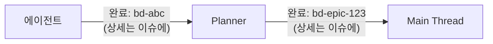

# /workflow:start 커맨드

멀티 에이전트 워크플로우를 시작합니다.

## 사용법

### 새 워크플로우 시작
```
/workflow:start <작업 요청>

예시:
/workflow:start 클러스터 알림 기능 추가
/workflow:start 로그인 버그 수정
/workflow:start API 응답 성능 최적화
```

### 중단된 워크플로우 재개
```
/workflow:start --resume <epic-id>

예시:
/workflow:start --resume beads-abc123
```

Gate 승인 대기 중 세션이 종료되거나 다른 작업을 진행한 후, 워크플로우를 이어서 진행할 때 사용합니다.

## 워크플로우 단계

### 1단계: 플래너 에이전트 호출

#### 새 워크플로우
`Task` 도구로 `workflow:planner` 에이전트를 호출하세요.

전달할 정보:
- 사용자 요청 원문
- 현재 프로젝트 경로

```
Task (subagent_type: workflow:planner, model: opus):
"사용자 요청: {요청 내용}
프로젝트: {현재 경로}"
```

#### 워크플로우 재개 (--resume)
중단된 워크플로우를 재개할 때는 Epic ID를 전달합니다.

```
Task (subagent_type: workflow:planner, model: opus):
"워크플로우 재개: {epic-id}
프로젝트: {현재 경로}"
```

Planner가 이슈 상태를 확인하고 중단된 Gate부터 재개합니다.

### 2단계: 플래너가 수행하는 작업
1. 요청 분석 및 작업 분류
2. beads 이슈 등록 (Epic + Sub-tasks)
3. **실행 계획 미리보기** (시각적 프로세스 표시)
4. **초기 계획 승인** (Gate 0)
5. 에이전트 호출 및 검증 게이트 통과

### 실행 계획 미리보기 예시
Gate 0에서 사용자는 다음과 같은 시각적 실행 계획을 확인합니다:
```
┌────────────────────────────────────────────────┐
│ 1. Interviewer  │ Requirements Clarification   │
├────────────────────────────────────────────────┤
│ 2. Architect    │ Technical Design             │
├────────────────────────────────────────────────┤
│ 3. Tester       │ Write Tests (TDD-RED)        │
├────────────────────────────────────────────────┤
│ 4. Coder        │ Implementation (TDD-GREEN)   │
├────────────────────────────────────────────────┤
│ 5. Reviewer     │ Code Review                  │
└────────────────────────────────────────────────┘

스킵: Designer (UI 변경 없음)
```

### 3단계: 검증 게이트 (Quality Gates)

```
Gate 0: 초기 계획 승인
    ↓
Interviewer → spec.md
    ↓
Gate 1: 요구사항 검증 ← 사용자 확인
    ↓
Designer/Architect → ux-scenario.md, design.md
    ↓
Gate 2: 설계 검증 ← 사용자 확인
    ↓
Tester (RED) → Coder (GREEN) → Reviewer
    ↓
Gate 3: 최종 검증 ← 사용자 확인
```

| Gate | 검증 대상 | 산출물 |
|------|----------|--------|
| Gate 0 | 작업 계획 | - |
| Gate 1 | 요구사항 | `.workflow/artifacts/{앱명}/{기능명}/spec.md` |
| Gate 2 | 설계 | `ux-scenario.md`, `design.md` |
| Gate 3 | 구현 결과 | 코드, 테스트, 리뷰, `test.md` |

### 4단계: 에이전트 실행
플래너가 필요에 따라 다음 에이전트들을 호출:
- `workflow:interviewer`: 요구사항 명확화 (**필수**, 단순 버그/중간 작업 제외)
- `workflow:architect`: 설계 필요 시
- `workflow:designer`: UI/UX 디자인 필요 시 (shadcn/ui)
- `workflow:coder`: 구현 필요 시
- `workflow:tester`: 테스트 필요 시
- `workflow:reviewer`: 리뷰 필요 시
- `workflow:writer`: 문서 2개 이상 생성 시

### 5단계: 완료 보고
모든 작업 완료 후 플래너가 결과 보고

## 에이전트 호출 규칙

**중요: 모든 Task 호출은 백그라운드로 실행합니다.**

- 모든 Task 호출 시 `run_in_background: true` 사용
- `TaskOutput` 도구로 결과 확인 (timeout 지정 권장)
- 여러 독립적인 에이전트는 동시에 백그라운드로 실행 가능

### 단일 에이전트 호출
```
Task (subagent_type: workflow:planner, model: opus, run_in_background: true):
"사용자 요청: {요청 내용}"
```

결과 확인:
```
TaskOutput (task_id: {반환된 task_id}, block: true, timeout: 300000)
```

### 병렬 에이전트 호출 (독립 작업)
단일 메시지에서 여러 Task 도구를 동시에 호출합니다:
```
Task (subagent_type: workflow:architect, model: opus, run_in_background: true):
"bd-xxx 설계 수행. bd show로 상세 확인."

Task (subagent_type: workflow:designer, model: opus, run_in_background: true):
"bd-yyy UX 설계 수행. bd show로 상세 확인."
```

모든 에이전트 완료 대기:
```
TaskOutput (task_id: {architect_task_id}, block: true, timeout: 300000)
TaskOutput (task_id: {designer_task_id}, block: true, timeout: 300000)
```

## 이슈 작성 규칙

**중요: 이슈 작성은 반드시 `guides/beads-issue-guide.md`를 읽고 계층 구조, 제목 형식, 템플릿을 준수합니다.**
**주의: 가이드 문서가 정본(Single Source of Truth)입니다. 이슈 계층, 제목 형식, 라벨 등의 내용을 이 문서에 중복 작성하지 마세요.**

### 이슈 업데이트 명령어
```bash
# 상세 내용 작성 (마크다운 지원)
bd update <issue-id> --description "$(cat <<'EOF'
## 작업 완료

### 요약
[작업 요약]

### 상세 내용
[상세 내용]

### 산출물
- [파일 경로]
EOF
)"
```

### 에이전트별 작성 내용

| 에이전트 | 필수 작성 내용 |
|----------|---------------|
| `interviewer` | 인터뷰 질문/답변 요약, 핵심 결정사항, 스펙 문서 경로 |
| `architect` | 설계 결정사항, 컴포넌트 구조, 설계 문서 경로 |
| `designer` | UX 플로우, 컴포넌트 목록, UX 시나리오 문서 경로 |
| `coder` | 변경 파일 목록, 구현 내용 요약, 빌드 결과 |
| `tester` | 테스트 케이스 목록, 커버리지, 테스트 보고서 경로 |
| `reviewer` | 리뷰 피드백, 평가 점수, 승인/반려 결정 |

### 작성 원칙

1. **완결성**: 이슈만 보고 작업 내용을 파악할 수 있어야 함
2. **추적성**: 관련 문서, 파일 경로 명시
3. **결정사항 기록**: 주요 의사결정과 근거 포함
4. **다음 단계**: 후속 작업이나 권장사항 명시

## 토큰 효율성

### 핵심 원칙: 상세는 이슈에, 반환은 ID만

Main Thread 컨텍스트를 최소화하기 위해 모든 결과는 이슈에 기록하고, 반환값은 ID만 포함합니다.



### 규칙
- 에이전트 호출 시 최소 컨텍스트만 전달 (이슈 ID)
- 에이전트 결과는 이슈(beads)에 기록, 반환값은 1-2줄
- Planner → Main 반환값도 Epic ID + 상태만
- 상세 내용 확인: `bd show <id>`
- 불필요한 단계는 자동 스킵

## 참조 문서

상세 정보는 다음 파일을 참조하세요:

### 에이전트 정의
- `agents/planner.md`: 워크플로우 오케스트레이터
- `agents/interviewer.md`: 요구사항 인터뷰어
- `agents/architect.md`: 시스템 설계자
- `agents/designer.md`: UX/UI 디자이너
- `agents/coder.md`: 코드 구현자
- `agents/tester.md`: 테스트 작성자
- `agents/reviewer.md`: 코드 리뷰어
- `agents/writer.md`: 문서 작성자

### 개발 가이드
- `guides/beads-issue-guide.md`: 이슈 계층 구조 및 작성 가이드라인
- `guides/gate-process.md`: Quality Gate 프로세스
- `guides/tdd-workflow.md`: TDD 워크플로우
- `guides/context-management.md`: 컨텍스트 관리
- `guides/language-guide.md`: 언어별 코딩 가이드

### 설계 가이드
- `guides/architecture/clean-architecture.md`
- `guides/architecture/hexagonal-architecture.md`
- `guides/architecture/api-design.md`
- `guides/architecture/database.md`

### 템플릿
- `templates/architecture-template.md`: 설계 문서 템플릿
- `templates/api-spec-template.md`: API 스펙 템플릿
- `templates/erd-template.md`: ERD 템플릿

## 성공 기준

워크플로우가 성공적으로 완료되면 다음 조건을 충족해야 합니다:

### 이슈 관리
- beads에 Epic 이슈 생성됨
- 필요한 Sub-task들이 Epic에 연결됨
- 모든 이슈가 closed 상태

### Quality Gates 통과
- Gate 0: 초기 계획 승인 ✓
- Gate 1: 요구사항 검증 ✓ (Interviewer 포함 시)
- Gate 2: 설계 검증 ✓ (Architect/Designer 포함 시)
- Gate 3: 최종 검증 ✓

### 산출물 생성
- `.workflow/artifacts/{앱명}/{기능명}/` 디렉토리에 문서 생성
- 포함된 에이전트에 따라: spec.md, design.md, ux-scenario.md, test.md

### 코드 품질 (Coder/Tester 포함 시)
- 테스트 통과
- 빌드 성공
- Reviewer 승인

## 사용 예시

### 예시 1: 새 기능 개발
사용자: "사용자 알림 기능 추가해줘"
동작:
1. Planner가 요청 분석 및 Epic 생성
2. Interviewer가 요구사항 인터뷰 수행
3. Architect가 기술 설계 작성
4. Tester가 테스트 코드 작성 (RED)
5. Coder가 구현 (GREEN)
6. Reviewer가 코드 리뷰
결과: 기능 구현 완료, Gate 1-3 모두 통과, beads 이슈 closed

### 예시 2: 버그 수정
사용자: "로그인 실패 시 에러 메시지가 안 보여"
동작:
1. Planner가 버그 분석 및 Epic 생성
2. Interviewer 스킵 (명확한 버그)
3. Coder가 버그 수정
4. Tester가 회귀 테스트 추가
5. Reviewer가 수정 검토
결과: 버그 수정 완료, 테스트 추가됨

### 예시 3: 리팩토링
사용자: "인증 모듈 클린 아키텍처로 리팩토링해줘"
동작:
1. Planner가 리팩토링 범위 분석
2. Architect가 새 구조 설계
3. Tester가 기존 동작 보존 테스트 작성
4. Coder가 리팩토링 수행
5. Reviewer가 아키텍처 일관성 검토
결과: 리팩토링 완료, 기존 테스트 모두 통과

## 문제 해결

### 워크플로우가 시작되지 않음
- **원인**: beads CLI가 설치되지 않음
- **해결**: `bd --version`으로 확인 후 설치

### Gate에서 응답이 없음
- **원인**: 에이전트 타임아웃 또는 세션 종료
- **해결**: `--resume <epic-id>`로 재개

### 에이전트 호출 실패
- **원인**: Task 도구 권한 부족 또는 모델 제한
- **해결**: 권한 확인, opus 모델 사용 확인

### beads 이슈 생성 실패
- **원인**: .beads/ 디렉토리 권한 또는 stealth 모드 설정
- **해결**: `bd ready`로 상태 확인

## 지금 시작하세요

플래너 에이전트를 호출하여 워크플로우를 시작합니다.
