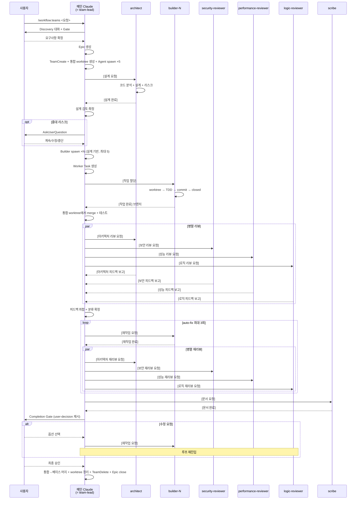

# /workflow:teams 커맨드

Agent Teams 기반 워크플로우를 시작합니다. **메인 Claude가 프레임워크의 team-lead 역할**을 수행하며 Discovery·조율·피드백 취합·Completion Gate를 직접 담당합니다. 설계·구현·리뷰·문서를 서브에이전트에 위임합니다.

> 단순 작업(버그 수정, 설정 변경 등)은 `/workflow:single`을 사용하세요.

## 사용법

### 새 워크플로우 시작
```
/workflow:teams <작업 요청>

예시:
/workflow:teams 클러스터 알림 기능 추가
/workflow:teams API 응답 성능 최적화
```

### 중단된 워크플로우 재개
```
/workflow:teams --resume <epic-id>
```

## 용어

| 용어 | 정의 |
|------|------|
| **메인 Claude** (= team-lead) | `/workflow:teams`를 실행하는 현재 세션. Agent Teams 프레임워크가 `TeamCreate` 호출자를 자동으로 팀 리드(`name: "team-lead"`)로 등록. Discovery부터 Completion Gate까지 전 생명주기 소유 |
| **architect** | 서브에이전트. Plan 단계에서 설계 초안을 작성하고, 리뷰 단계에서 아키텍처 리뷰를 수행 |
| **builder** | 서브에이전트. 할당받은 Worker Task를 worktree isolation에서 TDD로 구현 |
| **security-reviewer** | 서브에이전트. 보안 관점에서 코드를 검증 (OWASP Top 10, 인증/인가, 비밀 정보 등) |
| **performance-reviewer** | 서브에이전트. 성능 관점에서 코드를 검증 (N+1, 메모리, 알고리즘, I/O 등) |
| **logic-reviewer** | 서브에이전트. 로직/코드 품질 관점에서 검증 (로직 오류, 에러 처리, 네이밍, 테스트 등) |
| **scribe** | 서브에이전트. 리뷰 완료 후 구현 코드를 분석하여 문서를 생성 |
| **Discovery** | 사용자 주도 탐색 → AI 보완 질문 → 요점 정리 |
| **베이스 브랜치** | 사용자가 `/workflow:teams` 실행 시점에 체크아웃한 현재 브랜치. 워크플로우 최종 완료 시 통합 브랜치가 이 브랜치에 머지됨 |
| **통합 브랜치** | `wf-<epic-id>` 이름의 브랜치. team-lead 전용 worktree에서 builder 코드를 머지하고 통합 테스트·리뷰를 수행하는 작업 공간 |
| **worktree isolation** | team-lead와 각 builder가 독립 git worktree에서 작업하여 베이스 브랜치 보호 및 충돌 방지 |

## 핵심 원칙

1. **메인 Claude = team-lead**: 프레임워크 제약(TeamCreate 호출자가 자동으로 team-lead)에 따라 메인 Claude가 팀 리드 역할을 직접 수행. 조율·피드백 취합을 서브에이전트에 재위임하지 않음.
2. **서브에이전트는 실행자**: architect는 설계+아키텍처 리뷰, builder는 구현, 3명의 reviewer는 각 관점별 리뷰, scribe는 문서 생성. 조율·분류 판단은 메인 Claude가 담당.
3. **통신은 SendMessage**: 메인 → 팀원은 `SendMessage(to: "<name>")`, 팀원 → 메인은 `SendMessage(to: "team-lead")`.
4. **팀원 턴 종료는 내용 전달이 아님**: 팀원이 작업 결과를 보고하려면 반드시 `SendMessage(to: "team-lead", ...)` 명시 호출. 턴 종료만으로는 `idle_notification`만 전달됨.
5. **Resume은 컨텍스트 보존**: 메인이 `SendMessage(to: <member>)`를 다시 보내면 해당 팀원이 이전 턴의 컨텍스트(worktree, 변수 등)를 유지한 채 resume.
6. **beads가 Single Source of Truth**: Epic + Worker Task. 모든 상태는 beads에 영속 기록. 리뷰 피드백은 SendMessage로 보고하고 team-lead가 Epic comment에 주요 사항 기록.
7. **피드백 취합**: 4명의 리뷰어(architect 포함) 피드백을 team-lead가 수신·중복 제거·분류 확정 후 통합 auto-fix를 builder에 전달.
8. **팀 유지**: Completion Gate 수정 요청 시에도 같은 팀 유지. 최종 승인·취소 시에만 `TeamDelete`.
9. **코드베이스 탐색은 architect의 역할**: 메인 Claude는 코드베이스를 직접 탐색하지 않음. 코드 분석·설계는 architect에 위임. Discovery 단계에서는 사용자와의 요구사항 대화만 진행.

## 자주 발생하는 합리화 (경고)

| 합리화 | 반론 |
|--------|------|
| "Discovery 없이 바로 설계 시작해도 돼" | 요구사항 불명확한 채 설계하면 리뷰 단계에서 전면 재작업이 온다. |
| "builder 하나로 충분하니까 teams 안 써도 돼" | 그러면 `/workflow:single`을 쓰라. teams를 선택했으면 구조를 지켜라. |
| "리뷰어 피드백 중 사소한 건 무시해도 돼" | team-lead가 분류 판단을 한다. 리뷰어가 보고한 항목을 임의로 무시하지 마라. |
| "architect 설계 전에 builder를 먼저 시작하면 빠를 텐데" | 설계 없는 병렬 구현은 파일 충돌과 인터페이스 불일치로 귀결된다. |
| "Completion Gate에서 사소한 수정은 새 라운드 없이 직접 고쳐도 돼" | 피드백은 반드시 builder를 통해 반영. team-lead가 직접 코드를 수정하지 않는다. |

## 워크플로우 흐름



## 오케스트레이션 프로세스

### 1단계: Discovery — 요구사항 구체화

> 메인 Claude가 직접 수행. 사용자가 주도하고 AI는 응답.

#### 자동 스킵 판단

사용자 요청이 아래 조건을 **모두** 만족하면 Discovery를 스킵하고 2단계(Epic 생성)로 진행:
- 구현 대상이 명확
- Acceptance Criteria를 바로 작성할 수 있는 수준
- 범위(In/Out-of-Scope)가 분명

**스킵 시**: "요청이 충분히 구체적이므로 Discovery를 스킵하고 바로 진행합니다." 표시

#### Phase 1: 사용자 주도 탐색

**주도권: 사용자**. AI는 능동적으로 질문하지 않고 요청에 응답.

#### Phase 2: AI 보완 질문

사용자가 구체적 지시를 내리면 Phase 2 전환. 부족한 정보를 `AskUserQuestion` 한 번에 모아 질문 (최대 2라운드).

#### Phase 3: 요점 정리 + Discovery Gate

```markdown
## Discovery 요약

### 배경/동기
### 구체화된 요구사항
### 범위 (In-Scope / Out-of-Scope)
### 제약 조건
### 사용자 결정 사항
```

이어서 `AskUserQuestion`:
```
question: "[Discovery Gate] 위 내용으로 팀을 구성하고 진행할까요?"
header: "Discovery"
options:
  - label: "승인", description: "Epic 생성 후 팀 구성을 진행합니다"
  - label: "수정 필요", description: "Discovery를 계속합니다"
  - label: "취소", description: "작업을 중단합니다"
multiSelect: false
```

**강제 중단**: AskUserQuestion 호출 후 즉시 메시지 종료.

- **승인**: 2단계(Epic 생성) 진행
- **수정 필요**: Phase 1(사용자 주도 탐색)으로 복귀 (Epic·팀 미생성)
- **취소**: Epic·팀 미존재 상태 → beads 기록 없이 즉시 종료

### 2단계: Epic 생성 / 기존 티켓 연결

#### 2-A. 기존 티켓을 전달받은 경우

사용자가 기존 beads 티켓 ID(예: `bd-xxx`)를 전달한 경우:

```bash
bd show <ticket-id>
```

- **epic 타입**: 그대로 `<epic-id>`로 사용
- **task 타입**: 해당 task를 워크플로우의 최상위 이슈로 사용 (Epic 생성 불필요)

#### 2-B. 새 Epic 생성

`guides/beads-issue-guide.md` "Epic 생성" 섹션 템플릿에 따라 `bd create --type epic`을 실행합니다.

- description: 요청 분석, Discovery 요약, 실행 구조 섹션 포함
- acceptance: AC 체크리스트

#### 2-공통. 상태 전환 (2-A, 2-B 공통)

```bash
bd update <epic-id> --status in_progress
bd comments add <epic-id> "[Workflow] 시작"
```

생성된/연결된 `<epic-id>`를 이후 단계에서 사용합니다.

### 3단계: TeamCreate + 통합 Worktree + 팀원 spawn

#### 3-1. TeamCreate

```
TeamCreate(team_name: "wf-<epic-id>", description: "워크플로우: {기능명}", agent_type: "orchestrator")
```

TeamCreate 호출자(메인 Claude)가 자동으로 `name: "team-lead"`, `agentType: "orchestrator"`로 팀에 등록됩니다.

#### 3-1b. 통합 Worktree 생성

베이스 브랜치(현재 브랜치)에서 통합 브랜치를 분기하고 worktree를 생성합니다.

```bash
# 현재 브랜치를 베이스 브랜치로 기록
BASE_BRANCH=$(git branch --show-current)

# 통합 worktree 생성 (베이스 브랜치에서 분기)
git worktree add .claude/worktrees/wf-<epic-id> -b wf-<epic-id>
```

> **이후 team-lead의 머지·테스트·리뷰는 모두 통합 worktree(`.claude/worktrees/wf-<epic-id>/`)에서 수행합니다.** 베이스 브랜치는 워크플로우 최종 완료 시까지 변경되지 않습니다.

#### 3-2. 팀원 spawn (builder 제외)

초기 spawn 5명: 1명 architect + 3명 reviewer + 1명 scribe. **builder는 architect 설계 완료 후 동적 생성** (4-4단계).

```
# Architect
Agent(
  subagent_type: "workflow:architect",
  team_name: "wf-<epic-id>",
  name: "architect",
  run_in_background: true,
  description: "설계 + 아키텍처 리뷰",
  prompt: "Epic bd-<epic-id>. 현재는 대기 상태입니다. team-lead의 [설계 요청] SendMessage 수신 전까지 어떤 도구도 호출하지 마세요."
)

# Security Reviewer
Agent(
  subagent_type: "workflow:security-reviewer",
  team_name: "wf-<epic-id>",
  name: "security-reviewer",
  run_in_background: true,
  description: "보안 전문 리뷰",
  prompt: "Epic bd-<epic-id>. 현재는 대기 상태입니다. team-lead의 [보안 리뷰 요청] SendMessage 수신 전까지 어떤 도구도 호출하지 마세요."
)

# Performance Reviewer
Agent(
  subagent_type: "workflow:performance-reviewer",
  team_name: "wf-<epic-id>",
  name: "performance-reviewer",
  run_in_background: true,
  description: "성능 전문 리뷰",
  prompt: "Epic bd-<epic-id>. 현재는 대기 상태입니다. team-lead의 [성능 리뷰 요청] SendMessage 수신 전까지 어떤 도구도 호출하지 마세요."
)

# Logic Reviewer
Agent(
  subagent_type: "workflow:logic-reviewer",
  team_name: "wf-<epic-id>",
  name: "logic-reviewer",
  run_in_background: true,
  description: "로직/품질 리뷰",
  prompt: "Epic bd-<epic-id>. 현재는 대기 상태입니다. team-lead의 [로직 리뷰 요청] SendMessage 수신 전까지 어떤 도구도 호출하지 마세요."
)

# Scribe
Agent(
  subagent_type: "workflow:scribe",
  team_name: "wf-<epic-id>",
  name: "scribe",
  run_in_background: true,
  description: "문서 생성",
  prompt: "Epic bd-<epic-id>. 현재는 대기 상태입니다. team-lead의 [문서 요청] SendMessage 수신 전까지 어떤 도구도 호출하지 마세요."
)
```

이후 모든 통신은 `SendMessage(to: <name>)` 기반이며, 팀원은 `to: "team-lead"`로 메인 Claude에 응답합니다.

### 4단계: Plan 수립 (architect에 위임)

> architect에 설계를 위임하고, team-lead가 검토·확정합니다.

#### 4-1. 설계 요청

```
SendMessage(
  to: "architect",
  summary: "설계 요청",
  message: "[설계 요청] Epic bd-<epic-id>\n- Discovery 요약: {요약}\n- 작업 유형: {feature/bug/refactor/docs}\n- 영향 범위 힌트: {디렉토리/모듈}"
)
```

#### 4-2. 설계 완료 수신

architect가 `[설계 완료]`를 SendMessage로 보고합니다. 내용:
- 설계 초안 (도메인 모델, 인터페이스, 데이터 흐름)
- 작업 분할 draft (파일 경계, 의존성, TDD 계획)
- 리스크 분석 (5개 체크리스트)

#### 4-3. team-lead 검토·확정

- 경미한 수정: team-lead가 직접 조정 후 5단계 진행
- 대폭 수정 필요: architect에 `SendMessage [설계 수정 요청]`으로 재작업 지시
- 확정 후 Worker Task description에 설계 내용 반영

### 5단계: 설계 리스크 판단

architect의 `[설계 완료]`에 포함된 리스크 분석을 team-lead가 판단합니다.

**분기**:
- **경미**: 5-2단계(Builder 동적 spawn) 진행
- **중대**: 사용자에게 즉시 노출
  ```
  AskUserQuestion:
    question: "[설계 리스크] {리스크 요약}. 어떻게 진행할까요?"
    header: "Design Risk"
    options:
      - label: "계속", description: "리스크를 감수하고 그대로 진행"
      - label: "설계 수정", description: "architect에 재설계 요청"
      - label: "중단", description: "워크플로우 중단, TeamDelete"
  ```

**중단 선택 시**: 전원 `shutdown_request` → `TeamDelete` → worktree 정리(`git worktree remove .claude/worktrees/wf-<epic-id>`) → `git checkout <base-branch>` → `bd comments add <epic-id> "[Workflow] 설계 리스크로 중단"` → Epic close.

#### 5-2. Builder 동적 spawn

> **리스크 판단 통과 후** builder를 생성합니다. 중단 시 불필요한 agent 낭비를 방지합니다.

architect의 작업 분할 draft에서 **병렬 실행 가능한 Work 수**(= 필요 builder 수 `N`)를 결정합니다.

> **규칙**: `N` = 의존성 없이 동시 실행 가능한 최대 Work 수. **상한 5개**. 순차 의존성이 있는 Work는 동일 builder에 연속 할당하므로 별도 builder를 생성하지 않습니다.

```
# N개 builder를 병렬 spawn (N = architect 설계 결과 기반, 최대 5)
for i in 1..N:
  Agent(
    subagent_type: "workflow:builder",
    team_name: "wf-<epic-id>",
    name: "builder-{i}",
    run_in_background: true,
    description: "TDD 구현 팀원",
    prompt: "Epic bd-<epic-id>. 현재는 대기 상태입니다. team-lead의 [작업 할당] SendMessage 수신 전까지 어떤 도구도 호출하지 마세요. 할당받으면 EnterWorktree → bd show → TDD 구현 → closed → SendMessage(to: \"team-lead\")로 [작업 완료] 보고."
  )
```

**예시**: architect가 3개 병렬 Work를 설계한 경우 → `builder-1`, `builder-2`, `builder-3` 생성.

### 6단계: Worker Task 생성 + 할당

#### 6-1. Worker Task 일괄 생성

각 builder당 1개(+ 필요 시 `Work #0: 공유 인터페이스`). `guides/beads-issue-guide.md` "Worker Task 생성" 섹션 템플릿 사용.

- 명령: `bd create "Work #N: {담당 모듈}" --parent <epic-id> --type task --labels "implementation,builder,teams"`
- description 본문에 **담당 builder 이름**(builder-{i}) 명시
- 의존성: `bd update <task-id> --blocked-by <other-id>` (필요 시)

#### 6-2. 작업 시작 지시

> **전제**: builder 할당 전에 통합 worktree(`.claude/worktrees/wf-<epic-id>/`)가 생성된 상태여야 합니다.

각 builder에 `SendMessage`:

```
# 각 builder에 대응하는 Worker Task를 SendMessage로 할당
SendMessage(
  to: "builder-{i}",
  summary: "작업 할당 Work #N",
  message: "[작업 할당] Worker Task: bd-<task-id-N>\n- Epic: bd-<epic-id>\n- 담당: {모듈/파일}\n- EnterWorktree 후 in_progress 전환, TDD 진행, 완료 시 closed + [작업 완료] SendMessage(to: \"team-lead\")"
)
```

각 builder에 병렬로 할당 가능. 의존성이 있는 builder는 선행 완료 후 지시.

### 7단계: 작업 진행 관리

builder가 `SendMessage(to: "team-lead", ...)`로 보고 시 `<teammate-message>` 대화 턴으로 자동 도착합니다. 기대 포맷:

```
수신 (from builder-{i}):
"[작업 완료] Worker Task: bd-<task-id>
- 브랜치: <branch-name>
- 경로: <worktree-path>
- 변경 파일: <file1, file2, ...>
- 테스트: PASS
- 빌드: PASS"
```

메인 Claude는 이 내용을 파싱하여 **브랜치/경로/변경파일을 세션 상태에 보관**합니다. 이후 코드 반영 시 사용.

**builder 무응답 시**: 해당 builder에 `SendMessage`로 재지시(resume). 반복 실패 시 `shutdown_request` 후 다른 builder 재할당.

### 8단계: 코드 반영

**통합 worktree**에서 `git merge --no-ff --no-commit`으로 builder 브랜치를 머지합니다. 커밋은 생성하지 않습니다.

#### 8-1. 반영 순서

의존성 순서 고려: 기반 모듈 → 의존 모듈.

#### 8-2. 반영 프로세스

```bash
# 1. 통합 worktree로 이동
cd .claude/worktrees/wf-<epic-id>

# 2. 각 builder 브랜치를 순차 머지 (의존성 순서대로)
for i in 1..N:
  git merge --no-ff --no-commit <builder-{i}-branch>

# 3. 머지 충돌 시: 파일 경계 규칙에 따라 담당 builder 버전 사용. 해결 불가 시 사용자에 AskUserQuestion으로 에스컬레이션.
# 4. staged → unstaged 전환
git reset HEAD
```

> **Worktree 보존**: builder worktree는 팀 해산 시점까지 유지합니다. 재작업 루프에서 재사용하기 때문. 최종 완료 시 worktree를 제거합니다.

### 9단계: 통합 테스트 + 빌드

**통합 worktree(`.claude/worktrees/wf-<epic-id>/`)에서** 프로젝트 전체 테스트·빌드 실행.
- 실패: 관련 builder에 `SendMessage [재작업 요청]`
- 성공: 10단계로

### 10단계: 병렬 리뷰 요청

4명에 동시 SendMessage:

```
SendMessage(
  to: "architect",
  summary: "아키텍처 리뷰 요청 라운드 1",
  message: "[아키텍처 리뷰 요청] Epic bd-<epic-id>\n- 반영된 파일: {목록}\n- Worker Task: {id 목록}\n- 리뷰 라운드: #1"
)

SendMessage(
  to: "security-reviewer",
  summary: "보안 리뷰 요청 라운드 1",
  message: "[보안 리뷰 요청] Epic bd-<epic-id>\n- 반영된 파일: {목록}\n- Worker Task: {id 목록}\n- 리뷰 라운드: #1"
)

SendMessage(
  to: "performance-reviewer",
  summary: "성능 리뷰 요청 라운드 1",
  message: "[성능 리뷰 요청] Epic bd-<epic-id>\n- 반영된 파일: {목록}\n- Worker Task: {id 목록}\n- 리뷰 라운드: #1"
)

SendMessage(
  to: "logic-reviewer",
  summary: "로직 리뷰 요청 라운드 1",
  message: "[로직 리뷰 요청] Epic bd-<epic-id>\n- 반영된 파일: {목록}\n- Worker Task: {id 목록}\n- 리뷰 라운드: #1"
)
```

### 11단계: 피드백 취합

team-lead가 4명의 피드백 보고를 **모두 수신할 때까지 대기**합니다.

#### 11-1. 수신 대기

각 리뷰어로부터:
- `[아키텍처 피드백 보고]` (architect)
- `[보안 피드백 보고]` (security-reviewer)
- `[성능 피드백 보고]` (performance-reviewer)
- `[로직 피드백 보고]` (logic-reviewer)

#### 11-2. 취합 규칙

- **중복 제거**: 같은 file:line을 여러 리뷰어가 지적한 경우, 더 높은 심각도 기준 우선
- **분류 확정**: team-lead가 직접 auto-fix/user-decision 확정
  - auto-fix: 객관적 기준 위반, 답이 하나
  - user-decision: 트레이드오프, 사용자 선호 개입
- **Epic comment에 기록**: 취합 결과 요약을 `bd comments add <epic-id>` 기록

#### 11-3. 통합 auto-fix 전달

취합된 auto-fix 항목을 담당 builder별로 분배하여 12단계 진행.

### 12단계: 피드백 루프 (최대 3회)

#### 12-1. auto-fix 루프

```
1. auto-fix 항목을 담당 builder에 분배
2. SendMessage(to: "builder-N",
    message: "[재작업 요청] 리뷰 라운드 #N\n- 항목: {구체 피드백}\n- 완료 후 [재작업 완료] SendMessage")
   → builder가 이전 worktree 컨텍스트를 유지한 채 resume
3. builder의 [재작업 완료] 수신
4. 변경점 재반영 (8단계 반복 — 같은 브랜치·경로)
5. 재리뷰 요청 (10단계 반복)
   단, 이전 라운드에서 "이슈 없음"이었던 리뷰어는 스킵 가능
6. 반복 (최대 3회)
7. 3회 초과: 남은 항목을 user-decision으로 승격.
   Epic comment에 승격 사유 기록.
```

#### 12-2. user-decision 처리

자동 수정하지 않음. 13단계 Completion Gate에서 사용자에게 제시.

### 13단계: 문서 생성

리뷰 완료 후, scribe에 문서 요청:

```
SendMessage(
  to: "scribe",
  summary: "문서 생성 요청",
  message: "[문서 요청] Epic bd-<epic-id>\n- 변경 파일: {목록}\n- Worker Task: {id 목록}\n- 기능 요약: {설명}"
)
```

scribe의 `[문서 완료]` 수신 후 14단계로 진행.

### 14단계: Completion Gate

사용자에게 결과를 제시합니다.

```markdown
## 워크플로우 완료 보고

### 구현 요약
{핵심 변경 3~5줄}

### 변경 파일
- ...

### 완료 검증 (증거 기반)
- [ ] 모든 Epic AC 항목이 구현됨 (AC 체크리스트 1:1 대조 결과)
- [ ] 전체 테스트 PASS (통합 worktree에서 실행 결과)
- [ ] 빌드 성공 (통합 worktree에서 실행 결과)
- [ ] 리뷰 auto-fix 항목 전수 반영 (리뷰 라운드 결과 대조)

### 리뷰 결과
- 라운드: N회
- auto-fix: N건 (전부 반영)
- 리뷰어별:
  - architect: N건
  - security-reviewer: N건
  - performance-reviewer: N건
  - logic-reviewer: N건

### 문서
- .workflow/docs/<epic-id>/ 에 생성 완료

### ⚠️ 사용자 판단 필요 항목 (user-decision)
1. [항목 1] — {설명}
   - 옵션 A: ...
   - 옵션 B: ...
   - reviewer 의견: ...
2. ...
```

이어서 `AskUserQuestion`:
```
question: "[Completion Gate] 워크플로우를 완료하시겠습니까? (user-decision 항목 N건)"
header: "Completion"
options:
  - label: "완료", description: "워크플로우 종료 및 팀 해산"
  - label: "수정 필요", description: "사용자 결정에 따라 재작업"
  - label: "취소", description: "작업을 중단합니다"
multiSelect: false
```

**강제 중단**: AskUserQuestion 호출 후 즉시 메시지 종료.

### 15단계: Completion Gate 분기

#### 15-1. 수정 필요 선택 시

**팀은 해산하지 않음**. 사용자 결정에 따라 루프 재진입:

- 기존 파일/로직 수정 → 기존 Worker Task 재open
- 새 파일/기능 추가 → 신규 Worker Task 생성 (6단계 반복)
- user-decision 옵션 적용 → 해당 항목의 담당 builder 기존 Task 재open

해당 builder에 `SendMessage [재작업 요청]` → builder가 resume → 8단계(코드 반영)부터 반복 → 리뷰 루프 재진입 → 14단계 복귀.

#### 15-2. 완료 선택 시

##### 15-2a. 통합 브랜치에 최종 코드 반영

8단계(코드 반영) 프로세스를 반복합니다. 8단계 이후 재작업이 없었다면 `git merge`는 "Already up to date"로 no-op입니다.

##### 15-2b. 베이스 브랜치에 최종 머지

통합 브랜치의 변경사항을 베이스 브랜치에 머지합니다.

```bash
# 1. 통합 worktree에서 변경사항 커밋 (머지 대상 생성)
cd .claude/worktrees/wf-<epic-id>
git add -u  # 추적된 파일만 (빌드 아티팩트 등 미추적 파일 제외)
git commit -m "wf-<epic-id>: {기능명} 통합"

# 2. 베이스 브랜치로 이동 (프로젝트 루트)
cd <project-root>
git checkout <base-branch>

# 3. 통합 브랜치를 베이스 브랜치에 머지
git merge --no-ff --no-commit wf-<epic-id>

# 4. staged → unstaged 전환 (사용자가 최종 커밋)
git reset HEAD
```

##### 15-2c. 팀 해산 + Worktree 일괄 정리

```
# 팀원 순차 shutdown
SendMessage(to: "architect", message: {type: "shutdown_request"})
for i in 1..N:  # N = 생성된 builder 수
  SendMessage(to: "builder-{i}", message: {type: "shutdown_request"})
SendMessage(to: "security-reviewer", message: {type: "shutdown_request"})
SendMessage(to: "performance-reviewer", message: {type: "shutdown_request"})
SendMessage(to: "logic-reviewer", message: {type: "shutdown_request"})
SendMessage(to: "scribe", message: {type: "shutdown_request"})
# 각 팀원의 shutdown_approved 수신 대기
```

```
TeamDelete()
```

```bash
# 모든 worktree 일괄 정리 (코드는 15-2b에서 이미 베이스 브랜치에 반영 완료)
for i in 1..N:
  git worktree remove .claude/worktrees/builder-{i}
git worktree remove .claude/worktrees/wf-<epic-id>

bd comments add <epic-id> "[Workflow] 완료"
bd close <epic-id>
```

> **커밋은 사용자가 직접 수행합니다.** 변경사항은 베이스 브랜치에 unstaged 상태로 남아 있습니다.

**사용자에게 간결한 결과 보고**:

```markdown
워크플로우 완료

| 주체 | 결과 |
|------|------|
| architect | ✅ |
| builder-* | ✅ |
| security-reviewer | ✅ |
| performance-reviewer | ✅ |
| logic-reviewer | ✅ |
| scribe | ✅ |
| 리뷰 라운드 | N회 |
| 변경 파일 | N개 |
| 문서 | .workflow/docs/<epic-id>/ |

Epic: {epic-id} (CLOSED) | `bd show {epic-id}`
```

**필수 규칙**:
- 통계 표를 2번 이상 출력하지 말 것
- 타임라인, 주요 성과 등 추가 요약을 작성하지 말 것

#### 15-3. 취소 선택 시

```
# 팀원 순차 shutdown (완료 선택 시와 동일)
TeamDelete()
```

```bash
# 모든 worktree 일괄 정리 (베이스 브랜치에 머지하지 않음)
for i in 1..N:
  git worktree remove .claude/worktrees/builder-{i} 2>/dev/null || true
git worktree remove .claude/worktrees/wf-<epic-id> 2>/dev/null || true

# 베이스 브랜치로 복귀
git checkout <base-branch>

# 남은 open 하위 이슈 일괄 close (sanity check)
for tid in $(bd list --parent <epic-id> --status open -q); do
  bd close $tid
done

bd comments add <epic-id> "[Workflow] 사용자 취소"
bd close <epic-id>
```

## 재개 프로세스 (--resume)

재개 절차와 지점 결정 매트릭스는 [`guides/context-management.md`](../../guides/context-management.md) "재개 워크플로우" 섹션을 단일 기준으로 사용합니다.

## 에러 핸들링

| 상황 | 처리 |
|------|------|
| Discovery Gate 거부/취소 | 즉시 종료 (Epic·팀 미존재, beads 기록 없음) |
| 설계 리스크 중대 | `AskUserQuestion` → 계속/설계 수정/중단 |
| builder 무응답 | `SendMessage` 재지시 (resume). 반복 실패 시 shutdown + 재할당 |
| 통합 테스트 실패 | 관련 builder에 `[재작업 요청]` |
| 리뷰 3회 초과 | 남은 항목을 user-decision으로 승격, Completion Gate에서 사용자 판단 |
| Completion Gate 취소 | 전원 shutdown + TeamDelete + 하위 이슈 일괄 close + `[Workflow] 사용자 취소` |

## SendMessage 프로토콜 표

### 정규 호출 포맷

모든 SendMessage 호출은 다음 3인자 포맷을 사용합니다:

```
SendMessage(
  to: "<name>",                   // architect / builder-{i} (i=1..N) / security-reviewer / performance-reviewer / logic-reviewer / scribe / team-lead
  summary: "<한 줄 요약 5-10 어절>",  // UI에 프리뷰로 표시
  message: "<접두어로 시작하는 본문>"   // 아래 접두어 표 참조
)
```

모든 본문은 아래 표의 접두어로 시작합니다. shutdown_request·shutdown_response는 예외로 JSON 객체 형태(`message: {type: "shutdown_request"}`)를 사용합니다.

### 메인 Claude (team-lead) ↔ architect

| 이벤트 | 방향 | 접두어 |
|--------|------|--------|
| 설계 요청 | team-lead → architect | `[설계 요청]` |
| 설계 완료 보고 | architect → team-lead | `[설계 완료]` |
| 설계 수정 요청 | team-lead → architect | `[설계 수정 요청]` |
| 아키텍처 리뷰 요청 | team-lead → architect | `[아키텍처 리뷰 요청]` |
| 아키텍처 피드백 보고 | architect → team-lead | `[아키텍처 피드백 보고]` |
| 아키텍처 재리뷰 요청 | team-lead → architect | `[아키텍처 재리뷰 요청]` |

### 메인 Claude (team-lead) ↔ builder

| 이벤트 | 방향 | 접두어 |
|--------|------|--------|
| 작업 할당 | team-lead → builder | `[작업 할당]` |
| 작업 완료 보고 | builder → team-lead | `[작업 완료]` |
| 재작업 요청 | team-lead → builder | `[재작업 요청]` |
| 재작업 완료 보고 | builder → team-lead | `[재작업 완료]` |
| 에스컬레이션 | builder → team-lead | `[에스컬레이션]` |

### 메인 Claude (team-lead) ↔ security-reviewer

| 이벤트 | 방향 | 접두어 |
|--------|------|--------|
| 보안 리뷰 요청 | team-lead → security-reviewer | `[보안 리뷰 요청]` |
| 보안 피드백 보고 | security-reviewer → team-lead | `[보안 피드백 보고]` |
| 보안 재리뷰 요청 | team-lead → security-reviewer | `[보안 재리뷰 요청]` |

### 메인 Claude (team-lead) ↔ performance-reviewer

| 이벤트 | 방향 | 접두어 |
|--------|------|--------|
| 성능 리뷰 요청 | team-lead → performance-reviewer | `[성능 리뷰 요청]` |
| 성능 피드백 보고 | performance-reviewer → team-lead | `[성능 피드백 보고]` |
| 성능 재리뷰 요청 | team-lead → performance-reviewer | `[성능 재리뷰 요청]` |

### 메인 Claude (team-lead) ↔ logic-reviewer

| 이벤트 | 방향 | 접두어 |
|--------|------|--------|
| 로직 리뷰 요청 | team-lead → logic-reviewer | `[로직 리뷰 요청]` |
| 로직 피드백 보고 | logic-reviewer → team-lead | `[로직 피드백 보고]` |
| 로직 재리뷰 요청 | team-lead → logic-reviewer | `[로직 재리뷰 요청]` |

### 메인 Claude (team-lead) ↔ scribe

| 이벤트 | 방향 | 접두어 |
|--------|------|--------|
| 문서 요청 | team-lead → scribe | `[문서 요청]` |
| 문서 완료 보고 | scribe → team-lead | `[문서 완료]` |

> **주의**: 메인 Claude의 팀 내 이름은 `team-lead`(프레임워크 고정). 팀원이 메인에 보고할 때 반드시 `to: "team-lead"` 사용.
> **수신 예시 표기**: 본 문서의 "수신 (from X):" 표기는 설명용이며, 실제 SendMessage 호출에 `from:` 인자는 없습니다.

## 참조 문서

### 에이전트
- `agents/architect.md`: 설계자 + 아키텍처 리뷰어
- `agents/builder.md`: 구현원 (worktree isolation, TDD, 이슈 상태 전환)
- `agents/security-reviewer.md`: 보안 전문 리뷰어
- `agents/performance-reviewer.md`: 성능 전문 리뷰어
- `agents/logic-reviewer.md`: 로직/품질 리뷰어
- `agents/scribe.md`: 문서 생성자
- `agents/compound.md`: 회고 분석 (독립 스킬)

### 가이드
- `guides/beads-issue-guide.md`: 이슈 계층 구조 + 템플릿 (단일 진실 원천)
- `guides/context-management.md`: 이슈 기반 컨텍스트 관리 + 재개 프로세스
- `guides/gate-process.md`: Discovery Gate + Completion Gate
- `guides/tdd-workflow.md`: TDD 워크플로우 (builder 참조)
- `guides/rename-checklist.md`: 리네이밍 치환 체크리스트
- `guides/coding-standards.md`: 코딩 표준

## 지금 시작하세요

위 오케스트레이션 프로세스에 따라 워크플로우를 실행합니다.
