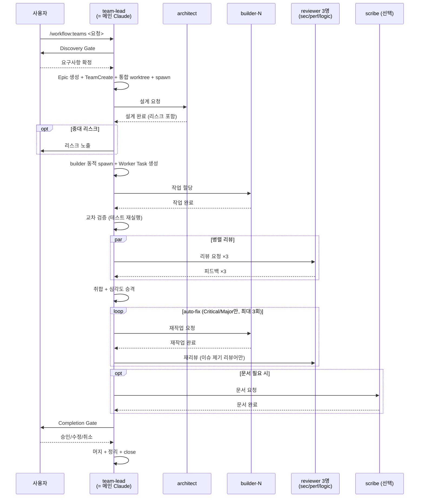

# /workflow:teams 커맨드

Agent Teams 기반 워크플로우. **메인 Claude가 team-lead**로서 Discovery·조율·피드백 취합·Completion Gate를 수행하고, 설계·구현·리뷰·문서를 서브에이전트에 위임합니다.

> 단순 작업(버그 수정, 설정 변경)은 `/workflow:single`을 사용하세요. 대부분의 작업은 Single로 충분합니다.

## 사용법

```
/workflow:teams <작업 요청>              # 새 워크플로우
/workflow:teams --resume <epic-id>      # 중단 재개 ([`guides/context-management.md`](../../guides/context-management.md))
```

## 팀 구성 (총 5+N명)

| 이름 | 모델 | 역할 |
|------|------|------|
| team-lead (= 메인 Claude) | opus | 전 생명주기 소유 (Discovery·조율·Gate) |
| architect | opus | 설계 전담 (아키텍처 리뷰 제외) |
| builder-1..N (N≤5) | sonnet | worktree isolation, TDD 구현 |
| security-reviewer | opus | 보안 리뷰 |
| performance-reviewer | opus | 성능 리뷰 |
| logic-reviewer | opus | 로직 + **아키텍처/SOLID/레이어** 통합 리뷰 |
| scribe (선택) | sonnet | on-demand 문서 생성 |

> 공통 규칙(금지 사항, 합리화 경고, 신뢰 수준, 혼란 관리, 가정 표면화, 완료 검증): [`references/agent-common.md`](../../references/agent-common.md)

## 핵심 원칙

1. **메인 Claude = team-lead**: `TeamCreate` 호출자가 자동 `name: "team-lead"`로 등록. 조율·분류 판단을 서브에이전트에 재위임하지 않음.
2. **리뷰어 3명 체제**: security + performance + logic. logic-reviewer가 SOLID·레이어·인터페이스 일관성 통합 검증 (self-review 방지를 위해 architect 설계와 logic 리뷰 분리).
3. **증거 기반 검증**: builder 보고 수신 후 team-lead가 통합 worktree에서 테스트·빌드 직접 재실행하여 보고 교차 검증.
4. **심각도 기반 루프 단축**: 1라운드 후 남은 Minor/Suggestion은 자동 user-decision 승격. Critical/Major만 auto-fix 반복.
5. **통신은 SendMessage**: 자연어 본문, 접두어 강제 없음. 팀원 → team-lead 보고는 반드시 `SendMessage(to: "team-lead")` 명시 호출 (턴 종료만으로는 `idle_notification`만 전달).
6. **beads가 Single Source of Truth**: Epic + Worker Task. 리뷰 피드백은 SendMessage로만 보고, 주요 사항은 team-lead가 Epic comment에 기록.
7. **코드베이스 탐색은 architect**: team-lead는 Discovery에서 사용자 대화만. 코드 분석·설계는 architect에 위임.

## 워크플로우 흐름



## 오케스트레이션 프로세스

### Phase 1: Discovery & Setup

#### 1-1. Discovery Gate
자세한 절차: [`guides/gate-process.md`](../../guides/gate-process.md)

- **자동 스킵**: 구현 대상이 명확하고 AC를 바로 쓸 수 있으면 스킵 → 1-2로
- **Phase 1-3**: 사용자 주도 탐색 → AI 보완 질문(최대 2라운드) → 요점 정리
- **AskUserQuestion**: 승인 / 수정 필요 / 취소
- 취소 시 Epic·팀 미존재 상태로 즉시 종료

#### 1-2. Epic 생성
[`guides/beads-issue-guide.md`](../../guides/beads-issue-guide.md) "Epic 생성" 템플릿 사용. 기존 티켓 전달 시 타입(epic/task)에 따라 그대로 사용 또는 최상위 이슈로 연결.

```bash
bd update <epic-id> --status in_progress
bd comments add <epic-id> "[Workflow] 시작"
```

#### 1-3. TeamCreate + 통합 worktree + 초기 spawn

```
TeamCreate(team_name: "wf-<epic-id>", description: "워크플로우: {기능명}", agent_type: "orchestrator")
```

호출자(메인 Claude)가 자동으로 `name: "team-lead"`로 등록됩니다.

```bash
BASE_BRANCH=$(git branch --show-current)
git worktree add .claude/worktrees/wf-<epic-id> -b wf-<epic-id>
```

이후 team-lead의 머지·테스트·리뷰는 모두 통합 worktree에서 수행. 베이스 브랜치는 최종 완료 시까지 변경되지 않습니다.

**초기 spawn (4명)**: architect + reviewer 3명. builder는 설계 완료 후 동적 생성, scribe는 필요 시 on-demand.

```
Agent(subagent_type: "workflow:architect", team_name: "wf-<epic-id>",
      name: "architect", run_in_background: true,
      description: "설계",
      prompt: "Epic bd-<epic-id>. 역할 대기.")

# security-reviewer, performance-reviewer, logic-reviewer도 같은 prompt 패턴으로 spawn
```

### Phase 2: Plan

#### 2-1. architect에 설계 요청

```
SendMessage(
  to: "architect",
  summary: "설계 요청",
  message: "설계 요청 — Epic bd-<epic-id>\n- Discovery 요약: {요약}\n- 작업 유형: {feature/bug/refactor}\n- 영향 범위 힌트: {디렉토리/모듈}"
)
```

#### 2-2. 설계 완료 수신 + 검토

architect가 설계 초안·작업 분할 draft·리스크 분석을 SendMessage로 보고. team-lead가 검토:
- 경미한 수정: team-lead가 직접 조정 후 다음 단계
- 대폭 수정: `SendMessage(to: "architect")` 재설계 요청
- **중대 리스크 탐지 시**: `AskUserQuestion`으로 계속/설계 수정/중단 중 선택

중단 선택 시: shutdown → `TeamDelete` → `cd <project-root>` → `git worktree remove` → `git checkout <base-branch>` → Epic comment `[Workflow] 설계 리스크로 중단` → Epic close.

#### 2-3. builder 동적 spawn

리스크 판단 통과 후 architect 작업 분할 draft의 **병렬 가능 Work 수**(`N`, 상한 5) 만큼 builder 생성. 의존성 있는 Work는 동일 builder에 연속 할당.

```
# N개 builder 병렬 spawn (각각 builder-1, builder-2, ..., builder-N)
for N in 1..<max>:
  Agent(subagent_type: "workflow:builder", team_name: "wf-<epic-id>",
        name: "builder-N", run_in_background: true,
        description: "TDD 구현",
        prompt: "Epic bd-<epic-id>. 역할 대기. 할당 시 EnterWorktree → bd show → TDD → closed → SendMessage(to: \"team-lead\") 보고.")
```

#### 2-4. Worker Task 생성 + 할당

[`guides/beads-issue-guide.md`](../../guides/beads-issue-guide.md) "Worker Task 생성" 템플릿 사용. 각 builder당 1개 (+ 필요 시 `Work #0: 공유 인터페이스`).

각 builder에 SendMessage:
```
SendMessage(
  to: "builder-N",
  summary: "작업 할당 Work #N",
  message: "작업 할당 — Worker Task bd-<task-id-N>, Epic bd-<epic-id>\n- 담당: {모듈/파일}\n- EnterWorktree 후 in_progress 전환, TDD 진행, 완료 시 closed + 보고"
)
```

### Phase 3: Implementation & Review

#### 3-1. 작업 수신 + 교차 검증

builder가 `SendMessage(to: "team-lead")`로 작업 완료 보고 시 `<teammate-message>`로 자동 도착. 기대 본문:
```
작업 완료 — Worker Task bd-<id>
- 브랜치: <branch-name>
- 경로: <worktree-path>
- 변경 파일: <list>
- 테스트: PASS / 빌드: PASS
```

**team-lead 증거 기반 검증 (필수)**:

```bash
# 1. 머지 전 통합 worktree로 이동
cd .claude/worktrees/wf-<epic-id>

# 2. builder 브랜치를 --no-ff --no-commit으로 머지 (의존성 순서대로)
git merge --no-ff --no-commit <builder-N-branch>

# 3. 실제 변경 파일 확인
git diff --name-only --cached

# 4. 보고된 파일 목록과 비교 — 불일치 시 해당 builder에 재작업 요청 (범위 준수 지시)

# 5. staged → unstaged
git reset HEAD

# 6. 통합 테스트·빌드 직접 재실행
# 프로젝트별 테스트/빌드 명령 실행. 실패 시 관련 builder에 재작업 요청
```

builder의 "PASS" 보고와 실제 실행 결과가 다를 경우 재작업 요청 SendMessage.

> **Worktree 보존**: builder worktree는 팀 해산까지 유지 (재작업 루프 재사용).

#### 3-2. 병렬 리뷰 (3명 동시)

통합 테스트·빌드 통과 후 3명에 동시 SendMessage:

```
SendMessage(
  to: "security-reviewer",
  summary: "보안 리뷰 요청 라운드 1",
  message: "보안 리뷰 요청 — Epic bd-<epic-id>\n- 반영된 파일: {목록}\n- Worker Task: {id 목록}\n- 리뷰 라운드: #1"
)

# performance-reviewer, logic-reviewer도 동일 패턴
```

> logic-reviewer가 SOLID·레이어·인터페이스 일관성까지 통합 검증합니다.

#### 3-3. 피드백 취합 + 심각도 승격

3명의 피드백 보고를 **모두 수신**한 뒤:

- **중복 제거**: 같은 file:line은 더 높은 심각도 기준
- **분류 확정**: auto-fix / user-decision 최종 확정
- **심각도 자동 승격**: [`guides/gate-process.md`](../../guides/gate-process.md) §심각도 자동 승격 규칙 참조
- **Epic comment 기록**: `bd comments add <epic-id> "[리뷰 취합 #N] auto-fix N건, user-decision M건, 요약 ..."`

#### 3-4. auto-fix 루프 (최대 3회, Critical/Major만)

```
1. auto-fix 항목을 담당 builder에 분배
2. SendMessage(to: "builder-N", message: "재작업 요청 — 라운드 #N\n- 항목: ...\n- 완료 후 보고")
   → builder가 이전 worktree 컨텍스트를 유지한 채 resume
3. builder 재작업 완료 보고 수신 → 3-1 교차 검증 반복
4. 재리뷰 요청 (이슈 제기 리뷰어에게만, 이전 "이슈 없음"이었던 리뷰어는 스킵)
5. 반복 (최대 3회)
6. 3회 초과: 남은 항목을 user-decision으로 승격, Epic comment에 승격 사유 기록
```

### Phase 4: Documentation & Completion

#### 4-1. 문서 생성 (조건부)

**team-lead가 판단**하여 scribe 호출. 판단 기준: [`agents/scribe.md`](../../agents/scribe.md) "호출 조건". 내부 리팩토링·단일 버그 수정 등은 스킵.

scribe가 아직 spawn되지 않았으면 이 시점에 spawn:
```
Agent(subagent_type: "workflow:scribe", team_name: "wf-<epic-id>",
      name: "scribe", run_in_background: true,
      description: "문서 생성",
      prompt: "Epic bd-<epic-id>. 역할 대기.")
```

SendMessage:
```
SendMessage(to: "scribe",
  summary: "문서 생성 요청",
  message: "문서 요청 — Epic bd-<epic-id>\n- 변경 파일: {목록}\n- 기능 요약: {설명}\n- 문서 범위: {API / 아키텍처 / CHANGELOG / README 중 필요 항목}")
```

#### 4-2. Completion Gate

사용자에게 결과 제시. 자세한 절차: [`guides/gate-process.md`](../../guides/gate-process.md).

```markdown
## 워크플로우 완료 보고

### 구현 요약
{핵심 변경 3~5줄}

### 변경 파일
- ...

### 완료 검증 (증거 기반)
- [ ] 모든 Epic AC 구현 (1:1 대조)
- [ ] 통합 worktree에서 전체 테스트 PASS (team-lead 직접 실행 결과)
- [ ] 빌드 성공 (team-lead 직접 실행 결과)
- [ ] 리뷰 auto-fix 전수 반영

### 리뷰 결과
- 라운드: N회 / auto-fix: N건 / user-decision: M건
- 리뷰어별: security N건 / performance N건 / logic N건

### ⚠️ 사용자 판단 필요 항목 (user-decision, 승격된 Minor/Suggestion 포함)
1. [항목 1] — {설명} (옵션 A/B + reviewer 의견)
```

```
AskUserQuestion:
  question: "[Completion Gate] 워크플로우를 완료하시겠습니까? (user-decision N건)"
  options: ["완료" / "수정 필요" / "취소"]
```

#### 4-3. Gate 분기

**수정 필요**: 팀 해산 안 함. 사용자 결정에 따라:
- 기존 파일/로직 수정 → 기존 Worker Task 재open → 담당 builder 재작업 (3-1부터 반복)
- 새 파일/기능 → 신규 Worker Task 생성 (2-4 반복)

**완료**:

```bash
# 1. 통합 worktree에서 최종 커밋 (머지 대상 생성)
cd .claude/worktrees/wf-<epic-id>
git add -u
git commit -m "wf-<epic-id>: {기능명} 통합"

# 2. 베이스 브랜치에 머지
cd <project-root>
git checkout <base-branch>
git merge --no-ff --no-commit wf-<epic-id>
git reset HEAD   # 사용자가 최종 커밋하도록 unstaged

# 3. 팀 해산
# SendMessage(to: "<name>", message: {type: "shutdown_request"}) 전원
TeamDelete()

# 4. worktree 일괄 정리 (베이스 디렉토리에서 실행 필수)
cd <project-root>
for N in 1..<max>: git worktree remove .claude/worktrees/builder-N
git worktree remove .claude/worktrees/wf-<epic-id>

# 5. Epic close
bd comments add <epic-id> "[Workflow] 완료" && bd close <epic-id>
```

> **중요**: `git worktree remove`는 제거 대상 내부에서 실행 시 실패. 반드시 `<project-root>`로 이동 후 실행.
> **커밋은 사용자가 직접 수행합니다.** 변경사항은 베이스 브랜치에 unstaged 상태로 남아 있습니다.

**취소**:
```bash
# 전원 shutdown + TeamDelete
cd <project-root>
for N in 1..<max>: git worktree remove .claude/worktrees/builder-N 2>/dev/null || true
git worktree remove .claude/worktrees/wf-<epic-id> 2>/dev/null || true
git checkout <base-branch>

# 남은 open 하위 이슈 일괄 close
for tid in $(bd list --parent <epic-id> --status open -q); do bd close $tid; done

bd comments add <epic-id> "[Workflow] 사용자 취소" && bd close <epic-id>
```

#### 4-4. 최종 보고

```markdown
워크플로우 완료

| 주체 | 결과 |
|------|------|
| architect / builder × N / reviewer × 3 / scribe | ✅/스킵 |
| 리뷰 라운드 | N회 |
| 변경 파일 | N개 |
| 문서 | .workflow/docs/<epic-id>/ (있는 경우) |

Epic: {epic-id} (CLOSED) · `bd show {epic-id}`
```

**필수 규칙**: 통계 표를 2번 이상 출력하지 말 것. 타임라인·주요 성과 등 추가 요약 금지.

## 재개 (--resume)

절차: [`guides/context-management.md`](../../guides/context-management.md) "재개 워크플로우" 섹션.

**공식 제한사항**: Claude Code Agent Teams는 in-process 팀원 resume을 지원하지 않습니다. `--resume` 시 team-lead가 팀원을 재spawn해야 하며, 이전 세션의 SendMessage 대화 맥락은 복원되지 않습니다. **beads 이슈(Epic comment, Worker Task description/comment)가 유일한 영속 저장소**입니다.

## 에러 핸들링

| 상황 | 처리 |
|------|------|
| Discovery Gate 거부/취소 | 즉시 종료 (Epic·팀 미존재) |
| 설계 리스크 중대 | `AskUserQuestion` → 계속/설계 수정/중단 |
| builder 보고와 실제 결과 불일치 | 재작업 요청 (범위 준수 지시) |
| builder 무응답 | SendMessage 재지시. 반복 실패 시 shutdown + 재할당 |
| 통합 테스트 실패 | 관련 builder에 재작업 요청 |
| 리뷰 3회 초과 | 남은 Minor 포함 전부 user-decision 승격 |
| Completion Gate 취소 | 전원 shutdown + TeamDelete + 하위 이슈 일괄 close |

## 통신 규칙

모든 SendMessage는 3인자 포맷:
```
SendMessage(
  to: "<name>",           # architect / builder-N / security-reviewer / performance-reviewer / logic-reviewer / scribe / team-lead
  summary: "<한 줄 요약>",  # UI 프리뷰
  message: "<자연어 본문>"  # 접두어 강제 없음. 다만 이슈 ID, 진행 상태, 테스트 결과, 변경 파일은 반드시 포함
)
```

팀원 → team-lead 보고는 **반드시 `SendMessage(to: "team-lead")` 명시 호출**. 턴 종료만으로는 `idle_notification`만 전달되어 내용이 유실됩니다.

shutdown만 JSON 객체 형태: `message: {type: "shutdown_request"}` / `{type: "shutdown_approved"}`.

## 참조 문서

### 에이전트
- [`agents/architect.md`](../../agents/architect.md) — 설계 전담
- [`agents/builder.md`](../../agents/builder.md) — 구현원
- [`agents/security-reviewer.md`](../../agents/security-reviewer.md) — 보안 리뷰
- [`agents/performance-reviewer.md`](../../agents/performance-reviewer.md) — 성능 리뷰
- [`agents/logic-reviewer.md`](../../agents/logic-reviewer.md) — 로직 + 아키텍처 리뷰
- [`agents/scribe.md`](../../agents/scribe.md) — 문서 (선택)

### 가이드
- [`guides/beads-issue-guide.md`](../../guides/beads-issue-guide.md) — 이슈 계층·템플릿
- [`guides/gate-process.md`](../../guides/gate-process.md) — Discovery·Completion Gate
- [`guides/context-management.md`](../../guides/context-management.md) — 재개 프로세스
- [`guides/tdd-workflow.md`](../../guides/tdd-workflow.md) — TDD 세부 규칙
- [`guides/hooks-integration.md`](../../guides/hooks-integration.md) — 품질 게이트 hook 예시
- [`references/agent-common.md`](../../references/agent-common.md) — 에이전트 공통 규칙

## 지금 시작하세요
