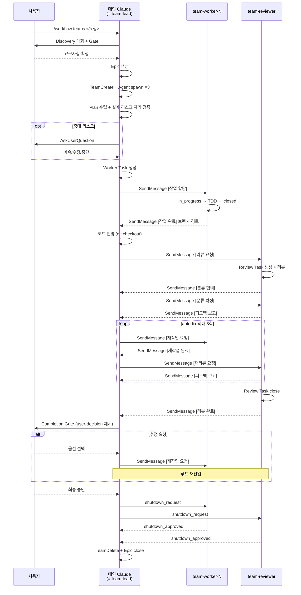

# /workflow:teams 커맨드

Agent Teams 기반 워크플로우를 시작합니다. **메인 Claude가 프레임워크의 team-lead 역할**을 수행하며 Plan 수립·조율·리뷰 루프·Completion Gate까지 직접 담당합니다. 구현과 리뷰만 서브에이전트에 위임합니다.

> 단순 작업(버그 수정, 설정 변경 등)은 `/workflow:single`을 사용하세요.

## 사용법

### 새 워크플로우 시작
```
/workflow:teams <작업 요청>

예시:
/workflow:teams 클러스터 알림 기능 추가
/workflow:teams API 응답 성능 최적화
```

### 중단된 워크플로우 재개
```
/workflow:teams --resume <epic-id>
```

## 용어

| 용어 | 정의 |
|------|------|
| **메인 Claude** (= team-lead) | `/workflow:teams`를 실행하는 현재 세션. Agent Teams 프레임워크가 `TeamCreate` 호출자를 자동으로 팀 리드(`name: "team-lead"`)로 등록. Discovery부터 Completion Gate까지 전 생명주기 소유 |
| **team-worker** | 서브에이전트. 할당받은 Worker Task를 worktree isolation에서 TDD로 구현 |
| **team-reviewer** | 서브에이전트. 반영된 코드를 리뷰하고 Review Task를 생성·관리 |
| **Discovery** | 사용자 주도 탐색 → AI 보완 질문 → 요점 정리 |
| **worktree isolation** | 각 team-worker가 독립 git worktree에서 작업하여 충돌 방지 |

## 핵심 원칙

1. **메인 Claude = team-lead**: 프레임워크 제약(TeamCreate 호출자가 자동으로 team-lead)에 따라 메인 Claude가 팀 리드 역할을 직접 수행. Plan/조율/리뷰 루프를 서브에이전트에 재위임하지 않음.
2. **서브에이전트는 실행자**: team-worker는 구현, team-reviewer는 리뷰. 조율·분류 판단은 메인 Claude가 담당.
3. **통신은 SendMessage**: 메인 → 팀원은 `SendMessage(to: "team-worker-N" | "team-reviewer")`, 팀원 → 메인은 `SendMessage(to: "team-lead")`.
4. **팀원 턴 종료는 내용 전달이 아님**: 팀원이 작업 결과를 보고하려면 반드시 `SendMessage(to: "team-lead", ...)` 명시 호출. 턴 종료만으로는 `idle_notification`만 전달됨.
5. **Resume은 컨텍스트 보존**: 메인이 `SendMessage(to: <member>)`를 다시 보내면 해당 팀원이 이전 턴의 컨텍스트(worktree, 변수 등)를 유지한 채 resume.
6. **beads가 Single Source of Truth**: Epic + Worker Task + Review Task. 모든 상태는 beads에 영속 기록.
7. **피드백 분류**: 리뷰 피드백은 **auto-fix**(자동 수정 — 최대 3회 루프)와 **user-decision**(Completion Gate에서 사용자 판단)으로 구분.
8. **팀 유지**: Completion Gate 수정 요청 시에도 같은 팀 유지. 최종 승인·취소 시에만 `TeamDelete`.

## 워크플로우 흐름



## 오케스트레이션 프로세스

### 1단계: Discovery — 요구사항 구체화

> 메인 Claude가 직접 수행. 사용자가 주도하고 AI는 응답.

#### 자동 스킵 판단

사용자 요청이 아래 조건을 **모두** 만족하면 Discovery를 스킵하고 2단계(Epic 생성)로 진행:
- 구현 대상이 명확
- Acceptance Criteria를 바로 작성할 수 있는 수준
- 범위(In/Out-of-Scope)가 분명

**스킵 시**: "요청이 충분히 구체적이므로 Discovery를 스킵하고 바로 진행합니다." 표시

#### Phase 1: 사용자 주도 탐색

**주도권: 사용자**. AI는 능동적으로 질문하지 않고 요청에 응답.

#### Phase 2: AI 보완 질문

사용자가 구체적 지시를 내리면 Phase 2 전환. 부족한 정보를 `AskUserQuestion` 한 번에 모아 질문 (최대 2라운드).

#### Phase 3: 요점 정리 + Discovery Gate

```markdown
## Discovery 요약

### 배경/동기
### 구체화된 요구사항
### 범위 (In-Scope / Out-of-Scope)
### 제약 조건
### 사용자 결정 사항
```

이어서 `AskUserQuestion`:
```
question: "[Discovery Gate] 위 내용으로 팀을 구성하고 진행할까요?"
header: "Discovery"
options:
  - label: "승인", description: "Epic 생성 후 팀 구성을 진행합니다"
  - label: "수정 필요", description: "Discovery를 계속합니다"
  - label: "취소", description: "작업을 중단합니다"
multiSelect: false
```

**강제 중단**: AskUserQuestion 호출 후 즉시 메시지 종료.

- **승인**: 2단계(Epic 생성) 진행
- **수정 필요**: Phase 1(사용자 주도 탐색)으로 복귀 (Epic·팀 미생성)
- **취소**: Epic·팀 미존재 상태 → beads 기록 없이 즉시 종료

### 2단계: Epic 생성

`guides/beads-issue-guide.md` "Epic 생성" 섹션 템플릿에 따라 `bd create --type epic`을 실행합니다.

- description: 요청 분석, Discovery 요약, 실행 구조 섹션 포함
- acceptance: AC 체크리스트
- 생성 후: `bd comments add <epic-id> "[Workflow] 시작"`
- 생성된 `<epic-id>`를 이후 단계에서 사용

### 3단계: TeamCreate + 팀원 spawn

#### 3-1. TeamCreate

```
TeamCreate(team_name: "wf-<epic-id>", description: "워크플로우: {기능명}", agent_type: "orchestrator")
```

TeamCreate 호출자(메인 Claude)가 자동으로 `name: "team-lead"`, `agentType: "orchestrator"`로 팀에 등록됩니다.

#### 3-2. 팀원 spawn

기본 2명 워커 + 1명 리뷰어. Discovery에서 명백히 대형 작업이면 3~4명으로 증설.

```
# Worker 1
Agent(
  subagent_type: "workflow:team-worker",
  team_name: "wf-<epic-id>",
  name: "team-worker-1",
  run_in_background: true,
  description: "TDD 구현 팀원",
  prompt: "Epic bd-<epic-id>. 현재는 대기 상태입니다. team-lead의 [작업 할당] SendMessage 수신 전까지 어떤 도구도 호출하지 마세요. 할당받으면 EnterWorktree → bd show → TDD 구현 → closed → SendMessage(to: \"team-lead\")로 [작업 완료] 보고."
)

# Worker 2 — 동일 포맷, name: "team-worker-2"

# Reviewer
Agent(
  subagent_type: "workflow:team-reviewer",
  team_name: "wf-<epic-id>",
  name: "team-reviewer",
  run_in_background: true,
  description: "코드 리뷰 팀원",
  prompt: "Epic bd-<epic-id>. 현재는 대기 상태입니다. team-lead의 [리뷰 요청] SendMessage 수신 전까지 어떤 도구도 호출하지 마세요. 요청받으면 Review Task 생성 → 리뷰 → SendMessage(to: \"team-lead\")로 [피드백 보고]."
)
```

이후 모든 통신은 `SendMessage(to: <name>)` 기반이며, 팀원은 `to: "team-lead"`로 메인 Claude에 응답합니다.

### 4단계: Plan 수립 (메인 Claude가 직접)

> 메인 Claude가 team-lead로서 이 단계를 직접 수행합니다. 별도 에이전트 호출 없음.

#### 4-1. 요구사항 분석
- Epic description의 Discovery 요약을 파싱
- 작업 유형(feature/bug/refactor/docs) 확인
- 영향 범위 파악

#### 4-2. 설계
- 도메인 모델·인터페이스·데이터 흐름 설계
- 필요 시 Mermaid 다이어그램 (layout: elk) — Worker Task description에 포함

#### 4-3. 작업 분할

| 원칙 | 내용 |
|------|------|
| **파일 경계 엄수** | 워커 간 수정 파일이 겹치지 않도록 분할 |
| **의존성 최소화** | 독립 구현 가능한 단위 |
| **공유 인터페이스는 별도 Worker Task** | 공유 타입·포트·인터페이스 선언은 `Work #0: 공유 인터페이스`로 한 워커에 우선 할당, 나머지 Work #1~N은 `blocked_by Work #0` |
| **팀원 수 적정화** | 기본 2명 워커, 플랜 결과가 1명으로 충분하면 두 번째 워커는 유휴 |

#### 4-4. TDD 계획 (구현 작업인 경우)

| 단계 | 대상 | 유형 |
|------|------|-----|
| RED | ... | 단위/통합 |
| GREEN | ... | - |

### 5단계: 설계 리스크 자기 검증 ⚠️ 필수

Plan 완료 직후, 5개 리스크를 점검합니다.

| # | 리스크 | 검증 질문 |
|---|--------|----------|
| 1 | **파일 오버랩** | 두 개 이상 워커가 동일 파일을 수정할 가능성? |
| 2 | **더러운 워킹트리 가정** | 중간 상태에서 후속 단계가 정상 동작? |
| 3 | **Cleanup ↔ Retry 경로 일관성** | 실패/재작업 시 되돌아갈 상태가 보존? |
| 4 | **3rd party 도구 전제** | `git apply` 등 실패 모드 이해 + fallback? |
| 5 | **상태 머신 전이 누락** | 각 단계 사전/사후 조건 명시 + 중간 상태 진입 가능? |

**탐지 시 분기**:
- **경미**: plan을 수정하여 완화 후 6단계 진행
- **중대**: 사용자에게 즉시 노출
  ```
  AskUserQuestion:
    question: "[설계 리스크] {리스크 요약}. 어떻게 진행할까요?"
    header: "Design Risk"
    options:
      - label: "계속", description: "리스크를 감수하고 plan 그대로 진행"
      - label: "plan 수정", description: "메인 Claude가 plan을 수정한 후 재검증"
      - label: "중단", description: "워크플로우 중단, TeamDelete"
  ```

**중단 선택 시**: 팀원에 `shutdown_request` → 승인 수신 → `TeamDelete` → `bd comments add <epic-id> "[Workflow] 설계 리스크로 중단"` → Epic close.

### 6단계: Worker Task 생성 + 할당

#### 6-1. Worker Task 일괄 생성

각 워커당 1개(+ 필요 시 `Work #0: 공유 인터페이스`). `guides/beads-issue-guide.md` "Worker Task 생성" 섹션 템플릿 사용.

- 명령: `bd create "Work #N: {담당 모듈}" --parent <epic-id> --type task --labels "implementation,worker,teams"`
- description 본문에 **담당 워커 이름**(team-worker-1 또는 team-worker-2) 명시
- 의존성: `bd update <task-id> --blocked-by <other-id>` (필요 시)

#### 6-2. 작업 시작 지시

각 워커에 `SendMessage`:

```
SendMessage(
  to: "team-worker-1",
  summary: "작업 할당 Work #1",
  message: "[작업 할당] Worker Task: bd-<task-id-1>\n- Epic: bd-<epic-id>\n- 담당: {모듈/파일}\n- EnterWorktree 후 in_progress 전환, TDD 진행, 완료 시 closed + [작업 완료] SendMessage(to: \"team-lead\")"
)
```

각 워커에 병렬로 할당 가능. 의존성이 있는 워커는 선행 완료 후 지시.

### 7단계: 작업 진행 관리

워커가 `SendMessage(to: "team-lead", ...)`로 보고 시 `<teammate-message>` 대화 턴으로 자동 도착합니다. 기대 포맷:

```
수신 (from team-worker-1):
"[작업 완료] Worker Task: bd-<task-id>
- 브랜치: <branch-name>
- 경로: <worktree-path>
- 변경 파일: <file1, file2, ...>
- 테스트: PASS
- 빌드: PASS"
```

메인 Claude는 이 내용을 파싱하여 **브랜치/경로/변경파일을 세션 상태에 보관**합니다. 이후 코드 반영 시 사용.

**워커 무응답 시**: 해당 워커에 `SendMessage`로 재지시(resume). 반복 실패 시 `shutdown_request` 후 다른 워커 재할당.

### 8단계: 코드 반영

**커밋 없이 변경점만 작업 브랜치에 unstaged로 적용**.

#### 8-1. 반영 순서

의존성 순서 고려: 기반 모듈 → 의존 모듈.

#### 8-2. 반영 프로세스

```bash
# 1. 작업 브랜치로 이동
git checkout <working-branch>

# 2. 각 워커 보고에서 받은 브랜치/파일로 체크아웃
git checkout <worker-1-branch> -- <file1> <file2>
git checkout <worker-2-branch> -- <file3> <file4>

# 3. staged → unstaged 전환
git reset HEAD

# 4. 충돌 시: 파일 경계 규칙에 따라 담당 워커 버전 사용. 해결 불가 시 사용자에 AskUserQuestion으로 에스컬레이션.
```

> **Worktree 보존**: 워커 worktree는 팀 해산 시점(14-2 완료 또는 14-3 취소)까지 유지합니다. 재작업 루프에서 재사용하기 때문.

### 9단계: 통합 테스트 + 빌드

프로젝트 전체 테스트·빌드 실행.
- 실패: 관련 워커에 `SendMessage [재작업 요청]`
- 성공: 10단계로

### 10단계: 리뷰 요청

```
SendMessage(
  to: "team-reviewer",
  summary: "리뷰 요청 라운드 1",
  message: "[리뷰 요청] Epic bd-<epic-id>\n- 반영된 파일: {목록}\n- Worker Task: {id 목록}\n- 통합 테스트: PASS\n- Review Task를 새로 생성해주세요 (라운드 #1)"
)
```

### 11단계: 분류 협의

reviewer가 `[분류 협의]` SendMessage를 보내면 분류 기준에 따라 응답:

- 분류 기준: `guides/beads-issue-guide.md` "피드백 분류 기준"
- 요약: **auto-fix**=객관적 기준 위반, **user-decision**=트레이드오프

```
SendMessage(to: "team-reviewer", summary: "분류 확정", message: "[분류 확정] 항목 X: auto-fix")
# 또는
SendMessage(to: "team-reviewer", summary: "분류 변경", message: "[분류 변경] 항목 X → user-decision, 이유: ...")
```

### 12단계: 피드백 루프 (최대 3회)

reviewer의 `[피드백 보고]` 수신 후:

#### 12-1. auto-fix 루프

```
1. auto-fix 항목을 담당 워커에 분배
2. SendMessage(to: "team-worker-N",
    message: "[재작업 요청] Review Task: bd-<id>\n- 항목: {구체 피드백}\n- 완료 후 [재작업 완료] SendMessage")
   → 워커가 이전 worktree 컨텍스트를 유지한 채 resume
3. 워커의 [재작업 완료] 수신
4. 변경점 재반영 (8단계 반복 — 같은 브랜치·경로)
5. SendMessage(to: "team-reviewer", message: "[재리뷰 요청] 수정 파일: {목록}. Review Task 라운드 #<N+1>")
   → reviewer resume (새 Review Task 생성)
6. 반복 (최대 3회)
7. 3회 초과: 남은 항목을 user-decision으로 승격.
   SendMessage(to: "team-reviewer", message: "[루프 종료 - user-decision 승격] Review Task: bd-<id>. 남은 항목 승격 사유 comment 후 close")
   → reviewer의 [리뷰 완료](승격 close) 수신 후 13단계.
```

#### 12-2. user-decision 처리

자동 수정하지 않음. 13단계 Completion Gate에서 사용자에게 제시.

### 13단계: Completion Gate

reviewer의 `[리뷰 완료]` 수신 후 사용자에게 결과를 제시합니다.

```markdown
## 워크플로우 완료 보고

### 구현 요약
{핵심 변경 3~5줄}

### 변경 파일
- ...

### 리뷰 결과
- 라운드: N회
- auto-fix: N건 (전부 반영)

### ⚠️ 사용자 판단 필요 항목 (user-decision)
1. [항목 1] — {설명}
   - 옵션 A: ...
   - 옵션 B: ...
   - reviewer 의견: ...
2. ...
```

이어서 `AskUserQuestion`:
```
question: "[Completion Gate] 워크플로우를 완료하시겠습니까? (user-decision 항목 N건)"
header: "Completion"
options:
  - label: "완료", description: "워크플로우 종료 및 팀 해산"
  - label: "수정 필요", description: "사용자 결정에 따라 재작업"
  - label: "취소", description: "작업을 중단합니다"
multiSelect: false
```

**강제 중단**: AskUserQuestion 호출 후 즉시 메시지 종료.

### 14단계: Completion Gate 분기

#### 14-1. 수정 필요 선택 시

**팀은 해산하지 않음**. 사용자 결정에 따라 루프 재진입:

- 기존 파일/로직 수정 → 기존 Worker Task 재open
- 새 파일/기능 추가 → 신규 Worker Task 생성 (6단계 반복)
- user-decision 옵션 적용 → 해당 항목의 담당 워커 기존 Task 재open

해당 워커에 `SendMessage [재작업 요청]` → 워커가 resume → 8단계(코드 반영)부터 반복 → 12단계 루프 재진입 → 13단계 복귀.

#### 14-2. 완료 선택 시

```
# 팀원 순차 shutdown
SendMessage(to: "team-worker-1", message: {type: "shutdown_request"})
SendMessage(to: "team-worker-2", message: {type: "shutdown_request"})
SendMessage(to: "team-reviewer", message: {type: "shutdown_request"})
# 각 팀원의 shutdown_approved 수신 대기
```

```
TeamDelete()
```

```bash
bd comments add <epic-id> "[Workflow] 완료"
bd close <epic-id>
```

**사용자에게 간결한 결과 보고**:

```markdown
워크플로우 완료

| 주체 | 결과 |
|------|------|
| team-worker-* | ✅ |
| team-reviewer | ✅ |
| 리뷰 라운드 | N회 |
| 변경 파일 | N개 |

Epic: {epic-id} (CLOSED) | `bd show {epic-id}`
```

**필수 규칙**:
- 통계 표를 2번 이상 출력하지 말 것
- 타임라인, 주요 성과 등 추가 요약을 작성하지 말 것

#### 14-3. 취소 선택 시

```
# 팀원 순차 shutdown (완료 선택 시와 동일)
TeamDelete()
```

```bash
# 남은 open 하위 이슈 일괄 close (sanity check)
for tid in $(bd list --parent <epic-id> --status open -q); do
  bd close $tid
done

bd comments add <epic-id> "[Workflow] 사용자 취소"
bd close <epic-id>
```

## 재개 프로세스 (--resume)

재개 절차와 지점 결정 매트릭스는 [`guides/context-management.md`](../../guides/context-management.md) "재개 워크플로우" 섹션을 단일 기준으로 사용합니다.

## 에러 핸들링

| 상황 | 처리 |
|------|------|
| Discovery Gate 거부/취소 | 즉시 종료 (Epic·팀 미존재, beads 기록 없음) |
| 설계 리스크 중대 | `AskUserQuestion` → 계속/plan 수정/중단 |
| 워커 무응답 | `SendMessage` 재지시 (resume). 반복 실패 시 shutdown + 재할당 |
| 통합 테스트 실패 | 관련 워커에 `[재작업 요청]` |
| 리뷰 3회 초과 | 남은 항목을 user-decision으로 승격, Completion Gate에서 사용자 판단 |
| Completion Gate 취소 | 팀원 shutdown + TeamDelete + 하위 이슈 일괄 close + `[Workflow] 사용자 취소` |

## SendMessage 프로토콜 표

### 정규 호출 포맷

모든 SendMessage 호출은 다음 3인자 포맷을 사용합니다:

```
SendMessage(
  to: "<name>",                   // team-worker-1 / team-worker-2 / team-reviewer / team-lead
  summary: "<한 줄 요약 5-10 어절>",  // UI에 프리뷰로 표시
  message: "<접두어로 시작하는 본문>"   // 아래 접두어 표 참조
)
```

모든 본문은 아래 표의 접두어로 시작합니다. shutdown_request·shutdown_response는 예외로 JSON 객체 형태(`message: {type: "shutdown_request"}`)를 사용합니다.

### 메인 Claude (team-lead) ↔ team-worker

| 이벤트 | 방향 | 접두어 |
|--------|------|--------|
| 작업 할당 | team-lead → worker | `[작업 할당]` |
| 작업 완료 보고 | worker → team-lead | `[작업 완료]` |
| 재작업 요청 | team-lead → worker | `[재작업 요청]` |
| 재작업 완료 보고 | worker → team-lead | `[재작업 완료]` |
| 에스컬레이션 | worker → team-lead | `[에스컬레이션]` |

### 메인 Claude (team-lead) ↔ team-reviewer

| 이벤트 | 방향 | 접두어 |
|--------|------|--------|
| 리뷰 요청 | team-lead → reviewer | `[리뷰 요청]` |
| 분류 협의 | reviewer → team-lead | `[분류 협의]` |
| 분류 확정/변경 | team-lead → reviewer | `[분류 확정]` / `[분류 변경]` |
| 피드백 보고 | reviewer → team-lead | `[피드백 보고]` |
| 재리뷰 요청 | team-lead → reviewer | `[재리뷰 요청]` |
| 리뷰 완료 | reviewer → team-lead | `[리뷰 완료]` |
| 루프 종료 승격 | team-lead → reviewer | `[루프 종료 - user-decision 승격]` |

> **주의**: 메인 Claude의 팀 내 이름은 `team-lead`(프레임워크 고정). 팀원이 메인에 보고할 때 반드시 `to: "team-lead"` 사용. 워커/리뷰어 spawn 시 `name`은 각각 `team-worker-1`, `team-worker-2`, `team-reviewer`.
> **수신 예시 표기**: 본 문서의 "수신 (from X):" 표기는 설명용이며, 실제 SendMessage 호출에 `from:` 인자는 없습니다.

## 참조 문서

### 에이전트
- `agents/team-worker.md`: 구현원 (worktree isolation, TDD, 이슈 상태 전환)
- `agents/team-reviewer.md`: 리뷰어 (Review Task 소유·관리, 분류 협의, 변경점 확인 후 close)
- `agents/compound.md`: 회고 분석 (독립 스킬)

### 가이드
- `guides/beads-issue-guide.md`: 이슈 계층 구조 + 템플릿 + 분류 기준 (단일 진실 원천)
- `guides/context-management.md`: 이슈 기반 컨텍스트 관리 + 재개 프로세스
- `guides/gate-process.md`: Discovery Gate + Completion Gate
- `guides/tdd-workflow.md`: TDD 워크플로우 (worker 참조)
- `guides/rename-checklist.md`: 리네이밍 치환 체크리스트
- `guides/coding-standards.md`: 코딩 표준

## 지금 시작하세요

위 오케스트레이션 프로세스에 따라 워크플로우를 실행합니다.
