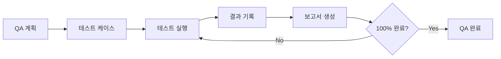

# QA Testing Skill

## 자동 활성화 조건

이 스킬은 다음 상황에서 **자동으로 활성화**됩니다:

### 키워드 감지

| 키워드 | 활성화 동작 |
|--------|------------|
| "QA", "품질 검증" | QA 프로세스 안내 |
| "테스트", "기능 확인" | `/qa` 또는 `/qa-run` 제안 |
| "화면 테스트", "UI 테스트" | MCP Puppeteer 테스트 제안 |
| "QA 계획", "테스트 계획" | `/qa-plan` 실행 |
| "QA 보고서", "테스트 결과" | `/qa-report` 실행 |

---

## QA 프로세스 개요



---

## 7단계 QA 프로세스

## QA 폴더 구조

```
.claude/docs/
├── active/
│   └── {feature-name}/
│       ├── 01-brainstorm.md
│       ├── 02-prd.md
│       ├── 03-architecture.md
│       ├── 04-erd.md
│       ├── 05-tasks.md
│       └── qa/                    ← QA 문서 위치
│           ├── QA_PLAN.md
│           ├── TEST_CASES.md
│           ├── TEST_RESULTS.md
│           └── QA_REPORT.md
│
└── complete/
```

---

### Phase 1: 요구사항 분석

**수행 작업:**

1. **기능 목록 수집**
   - PRD 문서 확인 (`.claude/docs/active/{feature}/02-prd.md`)
   - 태스크 목록 확인 (`worktree.json`)
   - 사용자 스토리 파악

2. **테스트 범위 정의**
   - In-scope: 테스트할 기능
   - Out-of-scope: 제외할 기능
   - 테스트 환경 정의

### Phase 2: 테스트 계획 수립

**QA 계획서 작성:**

```markdown
## QA 계획서

### 1. 테스트 개요
- 프로젝트명: {project_name}
- 테스트 기간: {start_date} ~ {end_date}
- 테스트 환경: {environment}

### 2. 테스트 범위
| 기능 | 우선순위 | 테스트 유형 |
|------|----------|------------|
| {feature_1} | P0 | E2E |
| {feature_2} | P1 | Integration |

### 3. 테스트 전략
- 테스트 피라미드: Unit(70%) - Integration(20%) - E2E(10%)
- Risk-based Testing: 고위험 기능 우선

### 4. 성공 기준
- 전체 테스트 통과율: 100%
- Critical 버그: 0개
- Major 버그: 해결 완료
```

### Phase 3: 테스트 케이스 설계

**Acceptance Criteria 기반:**

```gherkin
Given: 사전 조건
When: 사용자 액션
Then: 기대 결과
```

**테스트 케이스 템플릿:**

| ID | 기능 | 시나리오 | Given | When | Then | 상태 |
|----|------|----------|-------|------|------|------|
| TC-001 | 로그인 | 정상 로그인 | 로그인 페이지 | 올바른 자격 증명 입력 | 대시보드 이동 | Pending |

### Phase 4: 테스트 실행 (MCP Puppeteer)

**Puppeteer MCP 도구 활용:**

```javascript
// 1. 페이지 이동
mcp__puppeteer__puppeteer_navigate({ url: "http://localhost:3000" })

// 2. 스크린샷 캡처
mcp__puppeteer__puppeteer_screenshot({ name: "login-page" })

// 3. 폼 입력
mcp__puppeteer__puppeteer_fill({
  selector: "input[name='email']",
  value: "test@example.com"
})

// 4. 버튼 클릭
mcp__puppeteer__puppeteer_click({ selector: "button[type='submit']" })

// 5. JavaScript 실행
mcp__puppeteer__puppeteer_evaluate({
  script: "document.querySelector('.result').innerText"
})
```

**테스트 실행 체크리스트:**

```
□ 개발 서버 실행 확인 (npm run dev)
□ 테스트 데이터 준비
□ 브라우저 자동화 시작
□ 각 테스트 케이스 실행
□ 스크린샷 캡처
□ 결과 기록
```

### Phase 5: 결함 관리

**버그 분류:**

| 심각도 | 설명 | 예시 |
|--------|------|------|
| Critical | 시스템 장애 | 서버 크래시 |
| Major | 주요 기능 불가 | 로그인 실패 |
| Minor | 불편하지만 동작 | UI 깨짐 |
| Trivial | 사소한 이슈 | 오타 |

**버그 보고서 형식:**

```markdown
## BUG-001: {버그 제목}

- **심각도**: Critical/Major/Minor/Trivial
- **발견 위치**: {페이지/기능}
- **재현 단계**:
  1. Step 1
  2. Step 2
  3. Step 3
- **기대 결과**: {expected}
- **실제 결과**: {actual}
- **스크린샷**: {screenshot_path}
- **상태**: Open/In Progress/Fixed/Verified
```

### Phase 6: 보고서 생성

**QA 보고서 구조:**

```markdown
# QA 보고서

## 요약
- 총 테스트 케이스: {total}
- 통과: {passed} ({pass_rate}%)
- 실패: {failed}
- 블록됨: {blocked}

## 테스트 결과 상세

### 통과한 테스트
| ID | 기능 | 시나리오 | 결과 |
|----|------|----------|------|
| TC-001 | 로그인 | 정상 로그인 | ✅ PASS |

### 실패한 테스트
| ID | 기능 | 시나리오 | 실패 사유 |
|----|------|----------|----------|
| TC-005 | 결제 | 카드 결제 | API 오류 |

## 발견된 버그
| ID | 심각도 | 제목 | 상태 |
|----|--------|------|------|
| BUG-001 | Major | 로그인 토큰 만료 | Open |

## 권장 사항
1. {recommendation_1}
2. {recommendation_2}
```

### Phase 7: 회귀 테스트

**버그 수정 후:**

1. 수정된 버그 재검증
2. 관련 기능 회귀 테스트
3. 전체 테스트 재실행 (필요시)
4. 최종 보고서 업데이트

---

## MCP Puppeteer 테스트 패턴

### 1. 페이지 로드 테스트

```javascript
// 페이지 이동
await mcp__puppeteer__puppeteer_navigate({ url: "http://localhost:3000" })

// 스크린샷으로 확인
await mcp__puppeteer__puppeteer_screenshot({ name: "home-page" })
```

### 2. 폼 제출 테스트

```javascript
// 폼 필드 입력
await mcp__puppeteer__puppeteer_fill({
  selector: "#email",
  value: "user@test.com"
})
await mcp__puppeteer__puppeteer_fill({
  selector: "#password",
  value: "password123"
})

// 제출 버튼 클릭
await mcp__puppeteer__puppeteer_click({ selector: "button[type='submit']" })

// 결과 확인
await mcp__puppeteer__puppeteer_screenshot({ name: "after-submit" })
```

### 3. 네비게이션 테스트

```javascript
// 메뉴 클릭
await mcp__puppeteer__puppeteer_click({ selector: "nav a[href='/about']" })

// 페이지 전환 확인
await mcp__puppeteer__puppeteer_screenshot({ name: "about-page" })
```

### 4. 동적 콘텐츠 테스트

```javascript
// JavaScript로 요소 확인
const result = await mcp__puppeteer__puppeteer_evaluate({
  script: `
    const element = document.querySelector('.user-name');
    return element ? element.innerText : 'NOT_FOUND';
  `
})
```

### 5. 셀렉트 박스 테스트

```javascript
// 드롭다운 선택
await mcp__puppeteer__puppeteer_select({
  selector: "#country",
  value: "KR"
})
```

### 6. 호버 테스트

```javascript
// 요소에 호버
await mcp__puppeteer__puppeteer_hover({ selector: ".dropdown-trigger" })

// 호버 후 나타나는 메뉴 확인
await mcp__puppeteer__puppeteer_screenshot({ name: "hover-menu" })
```

---

## QA 상태 추적

### 저장 위치

**QA 문서 (기능별):**
```
.claude/docs/active/{feature}/qa/
├── QA_PLAN.md             # QA 계획서
├── TEST_CASES.md          # 테스트 케이스 목록
├── TEST_RESULTS.md        # 테스트 결과
├── BUG_REPORT.md          # 버그 보고서
└── QA_REPORT.md           # 최종 보고서
```

**상태 데이터:**
```
.claude-state/qa/
├── qa-plan.json           # QA 계획 JSON
├── test-cases.json        # 테스트 케이스 목록
├── test-results.json      # 테스트 결과
├── bugs.json              # 발견된 버그
└── screenshots/           # 테스트 스크린샷
```

### 상태 형식

```json
{
  "projectName": "Marketplace",
  "startDate": "2025-01-01",
  "status": "in_progress",
  "summary": {
    "total": 50,
    "passed": 35,
    "failed": 10,
    "blocked": 3,
    "pending": 2
  },
  "testCases": [...],
  "bugs": [...]
}
```

---

## 명령어 참조

| 명령어 | 설명 | 옵션 |
|--------|------|------|
| `/qa` | QA 프로세스 시작 | - |
| `/qa-plan` | QA 계획서 생성 | `--from-prd`, `--from-worktree` |
| `/qa-run [tc-id]` | 테스트 실행 | `--all`, `--failed` |
| `/qa-report` | QA 보고서 생성 | `--summary`, `--full` |
| `/qa-status` | QA 진행 상태 | - |

---

## 품질 기준

### 테스트 완료 기준

- [ ] 모든 P0 기능 테스트 완료
- [ ] Critical 버그 0개
- [ ] Major 버그 모두 해결
- [ ] 테스트 통과율 95% 이상
- [ ] 회귀 테스트 완료

### QA 문서 품질

- [ ] 모든 테스트 케이스 문서화
- [ ] 버그 재현 단계 명확
- [ ] 스크린샷 첨부
- [ ] 보고서 완성도

---

## 금지 사항

1. **테스트 없이 통과 처리 금지**: 실제 테스트 실행 필수
2. **버그 무시 금지**: 모든 버그 기록 및 추적
3. **스크린샷 누락 금지**: 주요 단계마다 증거 확보
4. **불완전한 보고서 금지**: 모든 항목 채워서 작성
5. **임의 종료 금지**: 100% 완료까지 진행

---

## 참조 문서

- `commands/qa.md` - QA 시작 명령어
- `commands/qa-plan.md` - QA 계획서 생성
- `commands/qa-run.md` - 테스트 실행
- `commands/qa-report.md` - 보고서 생성
- `commands/qa-status.md` - 상태 확인
- `.claude/templates/qa-plan-template.md` - 계획서 템플릿
- `.claude/templates/qa-report-template.md` - 보고서 템플릿
- `.claude/best-practices/qa-testing.md` - QA 베스트 프랙티스
